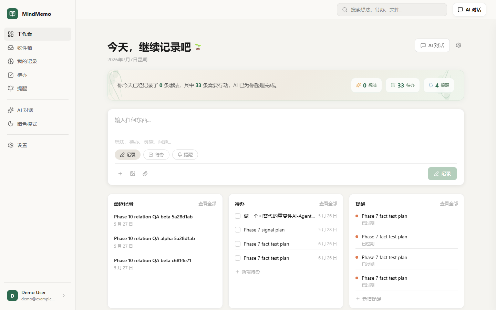
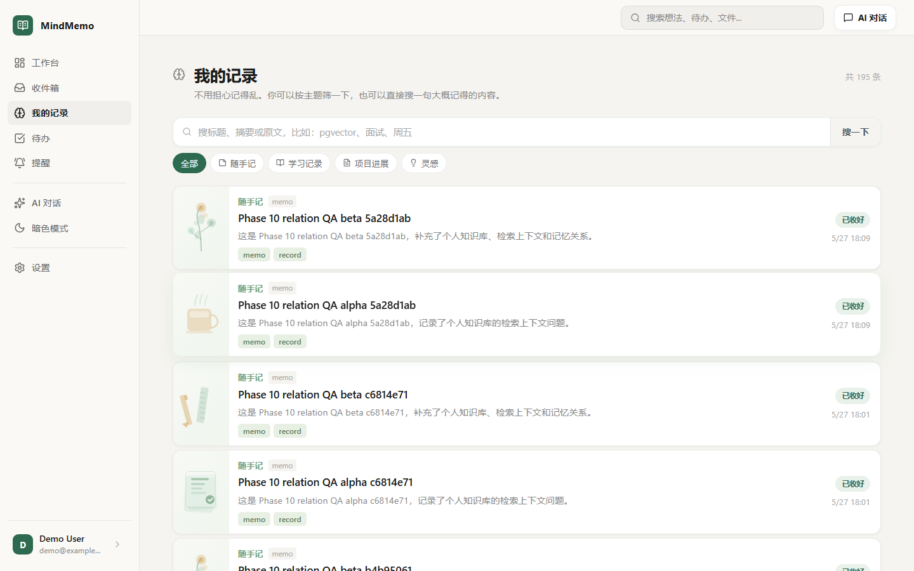
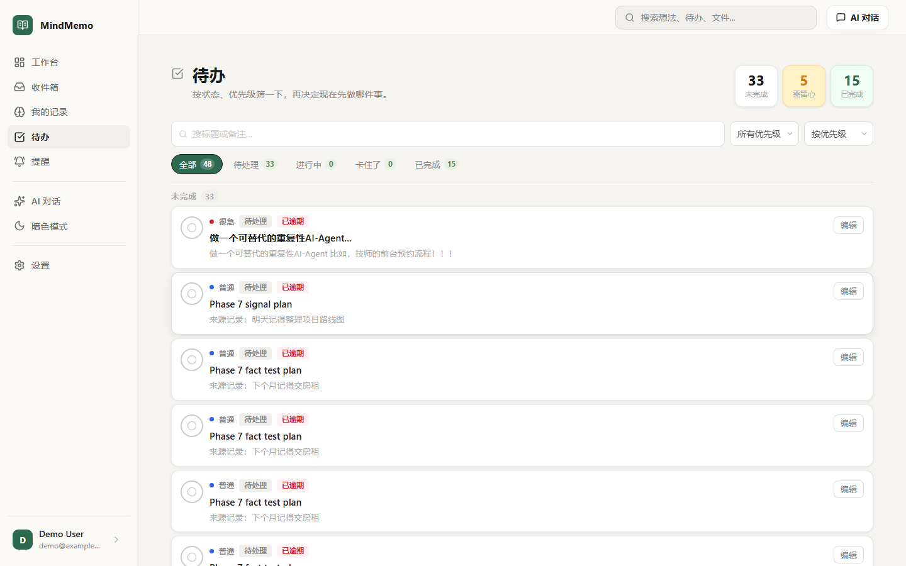
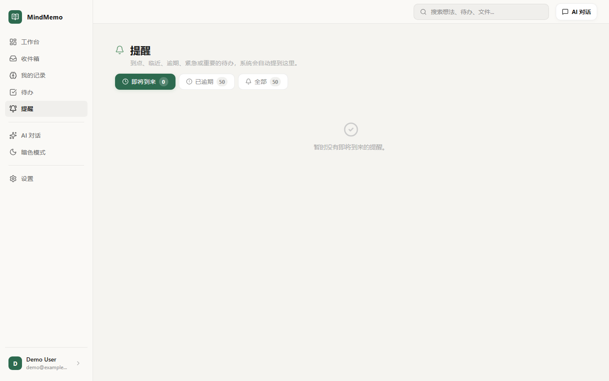
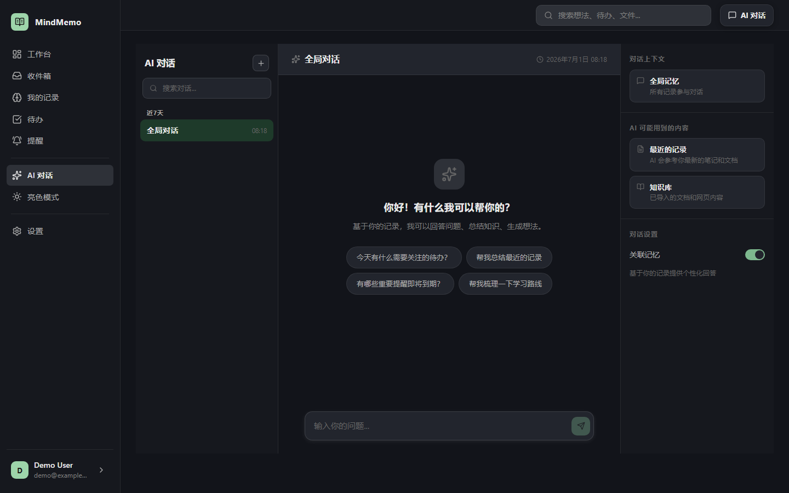
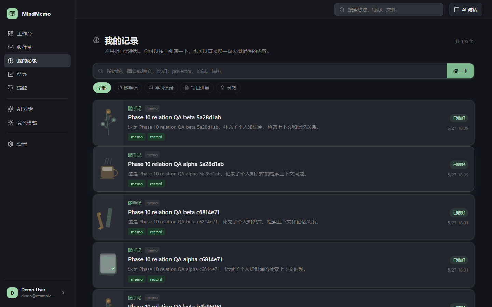

# 🌿 MindMemo

> 私人 AI 记忆工作台 —— 随手记录、智能整理、AI 问答，让每一个想法都不被遗忘。

MindMemo 是一个面向个人知识管理的 AI 增强型笔记系统。你可以用它快速记录想法、待办和灵感，系统会自动提取标签、关键词和实体，并通过 AI 对话帮助你检索、总结和关联你的记录。

---

## ✨ 界面预览

### 工作台 — 亮色模式


### 我的记录 — 水彩插画卡片


### 待办管理


### 智能提醒


### AI 对话 — 暗色模式


### 记录列表 — 暗色模式


---

## 🛠 核心功能

| 功能 | 说明 |
|------|------|
| 📝 **快速记录** | 随手记、待办、提醒三种模式一键切换，支持文字和文件附件 |
| 📋 **我的记录** | 水彩风插画卡片，8 种随机自然主题插画，分类筛选 + 全文搜索 |
| ✅ **待办管理** | 优先级排序、状态流转、截止日期提醒、逾期自动标红 |
| 🔔 **智能提醒** | 系统自动从待办中识别到期/逾期/紧急事项，PushDeer/ServerChan/企业微信推送 |
| 🤖 **AI 对话** | 三栏布局，基于所有记录的 RAG 问答，SSE 流式输出 |
| 📊 **AI 洞察** | 智能分析记录模式，生成学习路线图和知识洞察 |
| 🌓 **双色主题** | 亮色/暗色一键切换，纯黑暗色模式，localStorage 持久化 |

---

## 🛠 技术栈

| 层 | 技术 |
|---|---|
| **前端** | React 18 + TypeScript + Vite + TanStack Query |
| **后端** | Python FastAPI + SQLAlchemy + PostgreSQL |
| **AI/LLM** | 小米 MiMo (mimo-v2.5) / OpenAI 兼容 API |
| **向量检索** | pgvector + HNSW 索引 |
| **认证** | JWT (access + refresh token) |
| **通知** | PushDeer / ServerChan / 企业微信 Webhook |

---

## 📁 项目结构

```
MindMemo/
├── frontend/               # React + Vite 前端
│   ├── src/
│   │   ├── pages/          # 页面组件（Dashboard / Memories / Chat / Todos / Reminders / Settings）
│   │   ├── components/     # 可复用组件（AppShell / MarkdownRenderer / AiChatModal）
│   │   ├── api/            # API 客户端 + 类型定义
│   │   ├── styles/         # 按页面拆分的 CSS（自然绿色主题 + 暗色模式）
│   │   ├── auth/           # 认证逻辑（token 存储 + 自动刷新）
│   │   └── utils/          # 工具函数（时间格式化 / 资源 URL 解析 / 主题切换）
│   ├── package.json
│   └── vite.config.ts
├── backend/                # FastAPI 后端
│   ├── app/
│   │   ├── api/v1/         # REST 端点（auth / memories / todos / chat / qa / insights / reminders）
│   │   ├── services/       # 业务逻辑层（LLM / 提醒调度 / 通知 / 洞察）
│   │   ├── models/         # SQLAlchemy ORM 模型
│   │   ├── repos/          # 数据访问层
│   │   ├── schemas/        # Pydantic 请求/响应模型
│   │   ├── orchestration/  # QA 工作流（路由 → 检索 → 回答）
│   │   └── tools/          # Agent 工具（记忆搜索 / 天气 / 网页搜索）
│   ├── requirements.txt
│   └── .env                # 环境配置
├── screenshots/            # 界面截图
└── README.md
```

---

## 🚀 快速开始

### 环境要求
- Python 3.11+
- Node.js 18+
- PostgreSQL 15+ (with pgvector extension)

### 后端

```bash
cd backend

# 安装依赖
pip install -r requirements.txt

# 配置环境变量（参考 .env.example）
cp .env.example .env
# 编辑 .env 填入数据库连接、LLM API Key 等

# 启动服务
python -m uvicorn app.main:app --host 127.0.0.1 --port 6200 --reload
```

### 前端

```bash
cd frontend

# 安装依赖
npm install

# 启动开发服务器
npm run dev -- --host 127.0.0.1 --port 6100
```

### 访问地址
- 前端：[http://127.0.0.1:6100](http://127.0.0.1:6100)
- 后端 API 文档：[http://127.0.0.1:6200/docs](http://127.0.0.1:6200/docs)
- 健康检查：[http://127.0.0.1:6200/health](http://127.0.0.1:6200/health)

---

## ⚙️ 环境变量说明

### 核心配置

| 变量 | 说明 | 默认值 |
|---|---|---|
| `DATABASE_URL` | PostgreSQL 连接串 | `postgresql+psycopg://...` |
| `FRONTEND_ORIGIN` | 前端地址（CORS） | `http://127.0.0.1:6100` |
| `ACCESS_TOKEN_EXPIRE_MINUTES` | 访问令牌过期时间 | `10080`（7天） |

### LLM 配置

| 变量 | 说明 |
|---|---|
| `LLM_PROVIDER` | 内部任务 provider（`xiaomi` / `deepseek`） |
| `LLM_USER_FACING_PROVIDER` | 用户可见回答的 provider |
| `LLM_USER_FACING_MODEL` | 用户可见回答的模型名 |
| `XIAOMI_BASE_URL` | 小米 MiMo API 地址 |
| `XIAOMI_API_KEYS` | 小米 API Key（逗号分隔，自动轮询） |
| `XIAOMI_MODEL` | 小米模型名（如 `mimo-v2.5`） |
| `OPENAI_BASE_URL` | OpenAI 兼容 API 地址 |
| `OPENAI_API_KEY` | OpenAI API Key |

### Embedding 配置

| 变量 | 说明 |
|---|---|
| `EMBEDDING_PROVIDER` | 嵌入模式（`openai_compatible` / `local_hash`） |
| `EMBEDDING_BASE_URL` | 嵌入 API 地址 |
| `EMBEDDING_MODEL` | 嵌入模型名 |
| `EMBEDDING_DIMENSION` | 向量维度（如 `1536`） |

### 通知配置

| 变量 | 说明 |
|---|---|
| `PUSHDEER_PUSHKEY` | PushDeer 推送 Key |
| `SERVERCHAN_SENDKEY` | ServerChan 微信推送 Key |
| `SERVERCHAN_ENDPOINT_BASE` | ServerChan API 地址 |
| `WECOM_WEBHOOK_URL` | 企业微信群机器人 Webhook |

---

## 📡 主要 API 端点

| 方法 | 路径 | 说明 |
|---|---|---|
| `POST` | `/api/v1/auth/login` | 用户登录 |
| `POST` | `/api/v1/auth/register` | 用户注册 |
| `GET` | `/api/v1/memories` | 获取记忆列表（支持搜索/分类筛选） |
| `POST` | `/api/v1/ingest/text` | 快速文字记录 |
| `POST` | `/api/v1/ingest/capture` | 带附件记录（multipart） |
| `GET` | `/api/v1/memories/{id}` | 记忆详情 |
| `GET` | `/api/v1/memories/{id}/related` | 关联记忆 |
| `GET/POST/PATCH/DELETE` | `/api/v1/todos` | 待办 CRUD |
| `GET` | `/api/v1/dashboard/reminders` | 提醒列表 |
| `PATCH/DELETE` | `/api/v1/dashboard/reminders/{id}` | 修改/删除提醒 |
| `GET/POST` | `/api/v1/chat/sessions` | 对话会话管理 |
| `POST` | `/api/v1/chat/sessions/{id}/ask-stream` | SSE 流式问答 |
| `POST` | `/api/v1/qa/ask` | 基于记忆的问答 |
| `GET` | `/api/v1/insights/overview` | AI 洞察概览 |

---

## 🎨 设计语言

项目采用自然绿色主题，支持亮色/暗色双色切换：

| 角色 | 亮色 | 暗色 |
|---|---|---|
| 主色 | `#6b9e7a` | `#4ea86b` |
| 深色 | `#2d6a4f` | `#5ec47e` |
| 淡绿背景 | `#e8f0e4` | `#1a2e20` |
| 页面背景 | `#faf9f7` | `#0f0f0f` |
| 卡片背景 | `#ffffff` | `#1e1e1e` |
| 主文字 | `#1a1a1a` | `#f0f0f0` |

- 水彩风 SVG 插画装饰（叶子、咖啡、山峦、花束、便签、书本、铅笔、灯泡 8 种随机图案）
- 圆角卡片 + 柔和阴影
- 宽松间距，大字体（标题 ≥ 1.05rem，正文 ≥ 0.9rem）
- 暗色模式纯黑底（`#0f0f0f`），零亮色残留

---

## 📄 License

MIT
