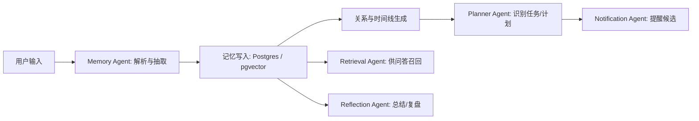
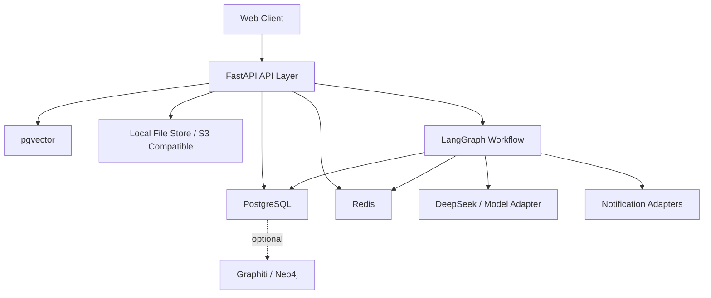
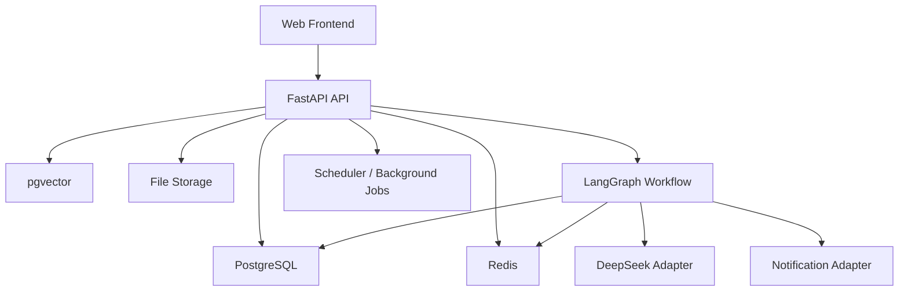

# MySecondBrain 需求分析文档 V1.1

## 0. 文档定位

- 项目名称：MySecondBrain
- 产品定位：面向个人用户的私有化 AI Second Brain / AI Personal OS
- 当前阶段：需求分析 + MVP 架构收敛
- 目标：单人 1~2 周做出可演示、可写简历、具备 AI Agent 与长期记忆亮点的 Web 版 MVP

## 0.1 已确认约束

1. 登录先按 `邮箱/手机号 + 密码`。
2. 微信提醒的 MVP 先走 `PushDeer / 企业微信 / wecomchan` 这类可落地通道。
3. `本地优先 + 云同步` 在 MVP 阶段不做真正双向实时同步，先支持部署模式切换。
4. PDF 先支持文本型 PDF，扫描件 OCR 后置。
5. 网页剪藏先做 `URL 导入 + 服务端正文抽取`，浏览器插件放二期。

---

## 1. 项目背景

### 1.1 为什么需要这个系统

传统个人信息管理工具把“记录”做得很多，把“记住、理解、提醒、关联、回顾”做得很弱。用户每天在笔记、TODO、收藏夹、聊天记录、网盘、截图里留下大量信息，但这些信息通常：

| 问题 | 结果 |
|---|---|
| 记录入口分散 | 信息孤岛严重 |
| 只支持关键词检索 | 找得到字，找不到语义 |
| 没有长期上下文 | 过去记录无法持续服务当前任务 |
| 缺少主动性 | 只有用户找系统，系统不会找用户 |
| 知识、任务、时间彼此割裂 | 很难形成“我最近到底在推进什么”的全局视图 |

### 1.2 当前传统备忘录的问题

传统备忘录/笔记工具的核心缺陷不是“不能记”，而是“不会用记忆”：

1. 不理解内容，只存原文。
2. 不自动抽取时间、实体、主题、行动项。
3. 不会把“学习笔记”和“长期目标”“项目推进”“待办事项”串起来。
4. 不支持时间维度回顾，难做复盘。
5. 无法形成用户级长期语义记忆。

### 1.3 为什么 AI Agent 适合解决

AI Agent 天然适合做“长期记忆助手”，因为它能同时承担 4 类工作：

| 能力 | 作用 |
|---|---|
| 理解 | 自动分类、抽标签、抽时间、识别任务 |
| 召回 | 用 RAG / 记忆检索找回相关历史 |
| 组织 | 建立关联、生成时间线、沉淀长期记忆 |
| 主动 | 提醒、冲突检测、总结、拆解任务 |

MySecondBrain 不是“AI 版记事本”，而是“把记录变成可计算记忆系统”。

---

## 2. 用户画像

MVP 优先服务：学生、职场用户、AI/技术用户。程序员与 AI 研究者可视为 AI/技术用户的细分；自媒体创作者放二期。

| 用户类型 | 优先级 | 典型场景 | 核心需求 | 对系统的价值点 |
|---|---:|---|---|---|
| 学生 | P0 | 课程笔记、考试安排、论文计划 | 时间线、知识管理、复习召回、提醒 | “我学过什么”“考试前该做什么” |
| 职场用户 | P0 | 会议记录、项目推进、面试安排、工作 TODO | 任务跟进、信息关联、提醒、周报 | “我最近工作重点是什么” |
| AI/技术用户 | P0 | 技术笔记、框架学习、长期 side project | 语义检索、项目记忆、Agent 工作流体验 | “我之前对 LangGraph 做过哪些记录” |
| 程序员 | P1 | Bug 记录、方案对比、代码研究 | 技术上下文召回、项目知识沉淀 | “这个问题我之前解决过没有” |
| AI 研究者 | P1 | 论文阅读、实验记录、模型对比 | 文献关联、实验 timeline、结论抽取 | “某主题我看过哪些 paper” |
| 自媒体创作者 | P2 | 灵感、选题、素材、脚本 | 灵感归类、素材关联、发布节奏提醒 | “这个选题以前写过吗” |

### 2.1 用户共性需求

1. 快速记录，不打断思路。
2. 后续能找回来，而且不是靠死记标签。
3. AI 能理解这条内容“属于什么、什么时候有用、和什么相关”。
4. 系统能主动提醒，而不是被动仓库。
5. 关键内容可解释、可修正、可删除。

---

## 3. 核心功能分析

## 3.1 智能记忆存储

### 为什么需要

如果输入只是原文落库，后面的检索、提醒、总结都会很弱。真正有效的是“写入时结构化”。

### 设计目标

用户输入一条内容后，系统自动产出：

- 分类
- 标签
- 关键词
- 时间信息
- 实体/主题
- 关联对象
- 是否含 TODO / 风险 / 提醒线索

### 业务流程

| 步骤 | 系统行为 | 输出 |
|---|---|---|
| 1. 原始接收 | 保存文本 / 链接 / PDF / 图片元信息 | raw_content |
| 2. 内容标准化 | 清洗格式、识别来源、提取正文 | clean_content |
| 3. AI 结构化分析 | 分类、标签、关键词、实体、时间抽取 | memory_metadata |
| 4. 任务识别 | 判断是否包含可执行事项 | todo_candidate |
| 5. 关系发现 | 与历史记忆做相似度 / 实体 / 时间关联 | relations |
| 6. 向量化与索引 | chunk、embedding、写入检索层 | retrievable memory |
| 7. 用户校正 | 用户修改分类/标签/时间/关系 | corrected memory |

### 推荐的写入模型

一条输入不要直接等于一条“最终记忆”，而应拆成 3 层：

1. 原始记录层：保留原文，方便追溯。
2. 结构化记忆层：分类、标签、时间、实体、摘要。
3. 检索索引层：分块、向量、关键词、关系边。

### 关键业务规则

| 场景 | 处理逻辑 |
|---|---|
| 有明确时间 | 提取 `event_time / due_time / reminder_time` |
| 有行动语义 | 标记为 `todo_candidate=true` |
| 有项目上下文 | 关联 `project_id / goal_id` |
| 与历史相似 | 建立 `related_memory_ids` |
| 信息冲突 | 进入冲突队列，等待用户确认 |
| 用户手动修正 | 修正结果优先于 AI 推断 |

### 难点

1. 中文时间表达解析复杂，如“下周三”“月底前”“考前两天”。
2. 一条内容可能同时属于“学习笔记 + TODO + 项目记录”。
3. 关系建立不能只靠向量相似度，否则误关联很多。
4. PDF / 网页正文抽取质量会直接影响后续 AI 理解。

### 优化建议

MVP 不要追求一次写入自动生成所有衍生动作。先把写入时结构化做稳，再逐步加自动任务创建、自动修改等高风险能力。

## 3.2 长期记忆系统

### 为什么需要

长期记忆系统的目标不是“存更多”，而是“让历史持续参与当前决策”。

### 记忆类型建议

| 记忆类型 | 作用 | 推荐存储 | MVP |
|---|---|---|---|
| 短期记忆 | 当前会话、当前工作流上下文 | Redis / LangGraph state | 是 |
| 长期记忆 | 稳定事实、长期目标、偏好、项目知识 | PostgreSQL + pgvector | 是 |
| Episodic 事件记忆 | 某天发生了什么、做了什么 | timeline_events | 是 |
| 时间线记忆 | 按时间组织个人历史 | relational timeline + query view | 是 |
| 图记忆 | 人/项目/主题/任务之间关系 | memory_relations；二期可接 Graphiti/Neo4j | 否，先轻量 |

### 推荐组织方式

```text
原始输入
-> 结构化记忆项 memory_item
-> 若干检索块 memory_chunk
-> 时间线事件 timeline_event
-> 若干关系边 memory_relation
-> 可选任务 todo
```

### 记忆分层策略

| 层 | 内容 | 生命周期 |
|---|---|---|
| Working Memory | 当前问答、当前 Agent 状态 | 分钟到小时 |
| Recent Memory | 最近 7~30 天的高频记录 | 天到月 |
| Long-Term Memory | 稳定知识、目标、项目摘要 | 长期 |
| Archived Memory | 低频但保留追溯价值 | 长期冷存储 |

### 重要机制

1. 重要度评分：决定是否提升为长期记忆。
2. 记忆归档：允许用户把某些内容退出高频召回层。
3. 删除与冻结：隐私内容可删除，错误内容可冻结不召回。
4. 冲突版本：同一事实更新时保留历史版本，避免粗暴覆盖。
5. 时间衰减：越旧内容默认召回权重越低，但重要内容例外。

### 为什么不建议 MVP 直接做全量图记忆

图记忆很亮眼，但工程成本高，核心难点不在“建图”，而在：

- 实体去重
- 关系可信度
- 时间有效性
- 图检索与回答质量评估

所以 MVP 建议先在 PostgreSQL 里做 `memory_relations` 轻关系层；二期再接 Graphiti 或 Neo4j。

## 3.3 AI 问答系统

### 目标问题示例

- 我最近有哪些重要事情？
- 我之前记录过哪些 LangGraph 内容？
- 最近我的任务完成情况怎么样？

### 为什么需要 RAG

个人长期记忆会持续增长，全量拼 Prompt 会导致：

- 成本高
- 召回不准
- 上下文污染
- 响应慢

### 推荐实现逻辑

| 阶段 | 设计 |
|---|---|
| Query 理解 | 识别问题类型：回顾 / 检索 / 汇总 / 计划 |
| 条件抽取 | 抽取时间范围、主题、项目、标签 |
| 多路检索 | 向量检索 + 关键词检索 + 结构化过滤 |
| 召回融合 | recent memory、long-term memory、todo、timeline 一起候选 |
| 重排 | 依据时间、相关度、重要度、来源可信度 |
| 上下文拼接 | 生成最小充分上下文 |
| 回答生成 | 输出答案 + 引用来源 + 可追溯片段 |
| 追问机制 | 信息不足时主动澄清 |

### 检索策略建议

1. 向量检索：解决语义近义表达。
2. 关键词/全文检索：解决专有名词、框架名、术语精确匹配。
3. 元数据过滤：按 `time_range / source_type / category / tags / project` 过滤。
4. 关系扩展：若命中某项目，再扩 1 跳相关记录。
5. 时间偏置：问“最近”时强拉高新记录权重。

### 上下文拼接规则

| 问题类型 | 优先上下文 |
|---|---|
| “最近有哪些重要事” | timeline + overdue todo + high importance memories |
| “记录过哪些 LangGraph 内容” | tag/entity 命中 + vector hits + source snippets |
| “任务完成情况怎么样” | todo stats + done logs + overdue list + recent summaries |

### 混合问答设计

建议做成两种模式：

- 仅个人记忆
- 个人记忆 + 外部搜索

外部搜索只在以下情况启用：

1. 用户显式勾选联网。
2. 本地记忆不足。
3. 问题明显需要外部知识。

### 难点

1. 旧记忆与新记忆冲突时，回答引用哪条。
2. “最近”“之前”“长期”这类时间语义需要稳定解析。
3. 用户不是要“原文”，而是要“结论 + 证据”。

### 设计要求

回答必须支持：

- 引用来源
- 时间上下文
- 命中记忆列表
- 一键跳回原始记录

## 3.4 Agent 主动能力

### 为什么需要

第二大脑如果永远等用户来问，本质还是“高级数据库”。主动能力才是产品差异点。

### 主动能力拆解

| 能力 | 触发条件 | 行为 | 风险控制 |
|---|---|---|---|
| 主动提醒 | 到期时间、临近事件、长期未完成 | 发送提醒 | 支持免打扰、频控 |
| 风险检测 | 截止期逼近、任务积压、信息冲突 | 提示风险 | 不自动改数据 |
| TODO 自动拆解 | 用户勾选授权 | 给出子任务建议 | 只建议，不默认执行 |
| 每日总结 | 每晚定时 / 用户触发 | 汇总新增、完成、风险 | 可关闭 |
| 周报生成 | 每周定时 | 输出项目推进、学习进展 | 可人工编辑 |
| 行为分析 | 连续多日数据积累 | 完成率、拖延趋势、主题分布 | 只做辅助解释 |

### 推荐工作方式

#### 1. 主动提醒

- 数据来源：TODO、时间线事件、长期目标
- 逻辑：基于 `due_time + importance + last_interaction + context`
- 输出：站内 / 微信通道提醒
- 关键要求：提醒要解释“为什么提醒你”

#### 2. 风险检测

识别以下典型风险：

- TODO 临期未推进
- 长期目标连续多天无进展
- 同一事件出现冲突记录
- 一个项目相关事项分散且无人跟进

#### 3. TODO 自动拆解

只在用户授权场景启用，例如：“请帮我把论文初稿拆成 5 个步骤”。

#### 4. 每日总结 / 周报

优先做模板化摘要，而不是全自动自由发挥。结构推荐：

- 今日新增
- 今日完成
- 未完成关键项
- 明日建议
- 风险提示

### 难点

1. 提醒太多会引发疲劳。
2. 风险判断需要可信但不过度惊扰。
3. 行为分析容易显得说教，必须轻量。

### 优化建议

MVP 只做三类主动能力：

1. 到期提醒
2. 每日总结
3. 任务风险提示

## 3.5 多 Agent 架构

### 是否需要 LangGraph

需要，但建议工程上克制使用。

MVP 可以保留“多 Agent 架构”的设计亮点，但实现上最好是：

- 一个 LangGraph 工作流
- 多个职责节点
- 明确状态流转
- 必要处加人工确认

而不是一开始做很多会自主对话的 Agent。

### Agent 划分建议

| Agent | 职责 | 输入 | 输出 |
|---|---|---|---|
| Memory Agent | 解析输入、抽取结构、写入记忆 | 用户输入/文件/链接 | memory_item / chunk / relation |
| Planner Agent | 识别 TODO、拆解任务、生成行动建议 | memory / user query | plan / sub_tasks |
| Reflection Agent | 总结、复盘、行为分析 | timeline / todo / recent memory | daily summary / weekly report |
| Notification Agent | 计算提醒与发送通知 | todo / timeline / risk events | notifications |
| Retrieval/Knowledge Agent | 问答时做检索、融合、引用 | user question | answer context |

### 状态流转建议



### LangGraph 中建议维护的状态

| 状态字段 | 用途 |
|---|---|
| input_payload | 原始输入 |
| parsed_entities | 实体/标签/时间 |
| memory_ids | 已写入记忆 |
| todo_candidates | 识别出的任务 |
| conflict_flags | 冲突/异常标记 |
| approval_required | 是否需要人工确认 |
| notification_candidates | 提醒候选 |
| response_context | 问答上下文 |

### 难点

1. 多 Agent 容易职责重叠。
2. 状态传递不清会导致“看起来很 Agent，实际很混乱”。
3. 单人开发最怕过度编排。

### 推荐原则

MVP 中 Agent 是职责边界，不是人格边界。先把它们做成清晰的服务节点。

---

## 4. 非功能需求分析

| 维度 | 要求 | MVP 建议指标 |
|---|---|---|
| 性能 | 记录不能卡顿 | 原始保存 P95 < 300ms |
| AI 处理延迟 | 结构化分析可异步 | 异步解析 P95 < 8s |
| 问答响应 | 用户可接受等待 | QA P95 < 6s |
| 并发 | 单人私有部署为主，但要可扩展 | 单实例支持 10~30 并发请求 |
| 安全 | 数据隔离、鉴权、最小权限 | 全表 `user_id` 隔离 |
| 隐私 | 敏感数据保护 | 支持加密、导出、删除 |
| 长期存储 | 可备份、可恢复 | Postgres 备份 + 文件存储版本化 |
| 向量扩展性 | 检索规模可增长 | pgvector + HNSW/IVFFlat |
| 可观测性 | AI 系统必须可调试 | trace、日志、检索命中记录 |
| 可解释性 | 回答和提醒可追溯 | source citation 必做 |

### 补充的关键非功能模块：可观测性与评估

建议从 MVP 起就埋这些指标：

- 检索命中率
- 引用覆盖率
- AI 标签采纳率
- 提醒点击率
- 用户手动修正率
- 每类 Agent 任务成功率

---

## 5. 技术架构建议

## 5.1 总体架构建议



## 5.2 前端推荐技术栈

推荐：`React + Vite + TypeScript + Tailwind CSS + shadcn/ui + TanStack Query + Zustand + Tiptap`

| 技术 | 作用 | 原因 |
|---|---|---|
| React + Vite | Web 前端基础 | 单人开发快，前后端分离清晰 |
| TypeScript | 类型约束 | 降低状态错乱与接口错误 |
| Tailwind + shadcn/ui | UI 组件与样式 | 做工具型产品效率高 |
| TanStack Query | 服务端状态 | 适合记忆列表、时间线、问答历史 |
| Zustand | 本地轻状态 | 管理筛选条件、草稿、会话 UI |
| Tiptap | 富文本编辑器 | 比自己造编辑器省很多时间 |

页面形态建议：不要做营销风首页，直接做工作台式产品界面：

- 左侧：导航
- 中间：主工作区
- 右侧：上下文面板 / AI 解读 / 来源引用

## 5.3 后端技术栈选择

结论：优先推荐 FastAPI。

| 方案 | 优点 | 缺点 | 适合度 |
|---|---|---|---|
| FastAPI | Python AI 生态强、Pydantic/OpenAPI 完整、单人开发效率高 | 大规模复杂企业治理不如 Java 成熟 | 最高 |
| Spring Boot | 工程治理强、企业级成熟 | 单人开发成本高，AI 生态不如 Python 顺手 | 中 |
| Node.js | 全栈 JS 统一、I/O 并发好 | AI / 文档处理 / 向量生态没有 Python 顺手 | 中 |

## 5.4 AI 技术栈分析

| 技术 | 适合做什么 | 适合度 | 建议 |
|---|---|---:|---|
| LangGraph | 多步骤、有状态、可中断 Agent 编排 | 高 | 主工作流编排核心 |
| LangChain | 模型与工具适配层 | 中高 | 轻用，别全家桶化 |
| LlamaIndex | 文档摄取、RAG、文档问答 | 中 | PDF/知识库重时可引入 |
| Mem0 | 记忆抽取/检索的现成 memory layer | 高 | 可直接复用，减少自研 |
| Graphiti | 时间感知图记忆 | 中高 | 二期亮点模块 |
| pgvector | 向量检索 | 高 | MVP 首选 |
| Neo4j | GraphRAG、复杂关系查询 | 中 | 二期可接，不建议 MVP 必做 |
| Redis | 热数据、队列、短期记忆、缓存 | 高 | 必要 |
| Unstructured / PyMuPDF | 文档抽取 | 高 | PDF 入库优先复用 |
| Readability / Trafilatura | 网页正文抽取 | 高 | 网页剪藏优先复用 |

### 一个很重要的架构建议

不要一开始自己手写完整 Memory Framework。建议：

- 用 LangGraph 做编排
- 用 Mem0 或自研轻量 memory schema 做存储逻辑
- 用 pgvector 做语义检索
- 用现成 PDF / 网页抽取库

这样时间才够。

---

## 6. 数据库设计建议

## 6.1 数据层建议

### 核心关系型表

| 表名 | 作用 | 核心字段 |
|---|---|---|
| users | 用户信息 | id, email, password_hash, status |
| user_settings | 用户偏好与通知配置 | user_id, timezone, quiet_hours, llm_provider |
| memory_items | 记忆主表 | id, user_id, source_type, content_raw, content_clean, category, importance_score, confidence_score, event_time, created_at |
| memory_chunks | 检索分块 | id, memory_id, chunk_index, chunk_text, embedding, keywords, page_no |
| memory_relations | 记忆关系 | id, user_id, from_memory_id, to_memory_id, relation_type, score |
| todos | 任务表 | id, user_id, title, description, status, priority, due_at, parent_id, source_memory_id |
| timeline_events | 时间线表 | id, user_id, event_type, ref_type, ref_id, event_time, summary |
| files | 文件表 | id, user_id, file_name, file_type, storage_path, parse_status |
| web_clips | 网页剪藏表 | id, user_id, url, title, extracted_text, extract_status |
| reminders | 提醒表 | id, user_id, ref_type, ref_id, remind_at, channel, status |
| agent_jobs | Agent 任务表 | id, user_id, job_type, input_ref, status, approval_required, result_json |
| qa_logs | 问答日志 | id, user_id, question, answer, citations_json, latency_ms |

### 关键设计建议

#### 1. `memory_items` 不要只存文本

至少要有：

- `category`
- `tags(jsonb)`
- `entities(jsonb)`
- `time_info(jsonb)`
- `importance_score`
- `source_type`
- `status`
- `is_archived`

#### 2. 向量不要单独再抽大而空的“向量表”

最实用的做法是：把 embedding 放进 `memory_chunks`，每块一个向量字段。

#### 3. `timeline_events` 不等于 `memory_items`

时间线是面向回顾视图的事件层，它可以由：

- 记忆写入
- TODO 变更
- 计划完成
- 提醒触发
- 总结生成

共同产生。

#### 4. Agent 任务表必须有

因为要做 LangGraph、多 Agent、提醒和总结，没有 `agent_jobs` / `agent_runs` 很难追踪失败原因。

### 二期可补表

- audit_logs
- sync_events
- prompt_versions
- retrieval_evaluations
- graph_nodes / graph_edges

---

## 7. MVP 最小可行版本

## 7.1 1~2 周必须做什么

### MVP 必做功能

| 模块 | 是否必须 | 原因 |
|---|---|---|
| 文本 Memo / TODO 录入 | 是 | 最核心入口 |
| PDF 上传 + 文本解析 | 是 | 能体现知识库能力 |
| AI 自动分类/标签/摘要 | 是 | 体现“不是普通笔记” |
| 向量检索 + AI 问答 | 是 | 体现长期记忆价值 |
| 时间线视图 | 是 | 体现长期记忆组织能力 |
| 提醒机制 | 是 | 体现主动 Agent |
| 用户修正 AI 结果 | 是 | 保证可控 |

### MVP 延后功能

| 模块 | 原因 |
|---|---|
| 真正图记忆 / Neo4j | 工程复杂度高 |
| 浏览器插件剪藏 | 插件开发会拖慢节奏 |
| 扫描件 OCR | 文档处理成本高 |
| 多模态图片理解 | MVP 不必要 |
| 完全自治 Agent | 风险高、调试难 |
| 本地实时双向同步 | 真正难点，不适合 2 周 |
| MCP / 跨应用自动操作 | 后续亮点 |

## 7.2 建议的 2 周拆期

### 第 1 周

- 用户系统基础版
- Memo / TODO 输入
- `memory_items / chunks / embeddings`
- PDF 文本解析
- AI 自动分类、标签、摘要
- 问答接口打通

### 第 2 周

- 时间线页
- 提醒服务
- AI 来源引用
- 冲突/修正页
- 每日总结
- 演示闭环优化

### 一个很现实的产品建议

如果是单人 1~2 周，网页剪藏插件一定不要进首版。首版做“粘贴 URL -> 后端抽正文 -> 存剪藏”已经足够演示能力。

---

## 8. 项目亮点（简历 / 面试 / 工程项目）

## 8.1 面试级表达

我做了一个面向个人用户的 AI Second Brain，核心不是笔记，而是长期记忆系统。系统基于 LangGraph 编排多 Agent，把用户输入自动结构化为记忆、时间线和任务，并通过 pgvector 做长期语义召回，实现 AI 问答、主动提醒与阶段性总结。

## 8.2 简历级表达

- 设计并实现私有化 AI Second Brain Web 系统，支持 Memo/TODO/PDF/网页内容的长期记忆管理与语义检索。
- 基于 FastAPI + LangGraph + pgvector 构建多 Agent 工作流，实现记忆写入、问答召回、主动提醒、时间线总结。
- 设计可解释的 RAG 记忆系统，支持来源引用、人工修正、冲突检测与长期语义关联。

## 8.3 工程项目级表达

- 把笔记、任务、时间线、问答、提醒统一到一个可计算的个人记忆模型。
- 采用关系型主存储 + 向量检索 + Agent 编排的工程架构，而非仅做聊天壳子。
- 在有限开发周期内，通过复用 LangGraph、Mem0、pgvector、现成文档抽取能力，快速做出具备长期记忆与主动能力的 AI 应用原型。

---

## 9. 系统模块划分

| 模块 | 子模块 | 说明 |
|---|---|---|
| 输入采集层 | Memo、TODO、URL、PDF、文件上传 | 所有内容入口统一进入 Inbox |
| 内容解析层 | 文本清洗、PDF 解析、网页抽取 | 将非结构化输入转为 clean content |
| 记忆核心层 | memory_items、chunks、relations、timeline | 系统核心资产 |
| 检索问答层 | hybrid retrieval、RAG、citation | 回答基于记忆而非空想 |
| Agent 编排层 | Memory / Planner / Reflection / Notification | LangGraph 驱动 |
| 提醒通知层 | 站内、微信通道、定时任务 | 主动能力出口 |
| 用户控制层 | 修正、归档、删除、权限、设置 | 记忆可管理 |
| 评估观测层 | logs、trace、hit rate、latency | AI 产品必须有 |
| 同步扩展层 | 本地部署、云部署、后续同步 | 二期扩展 |

---

## 10. 页面设计建议

| 页面 | 核心内容 | 说明 |
|---|---|---|
| Dashboard | 今日重点、最近记忆、待办、提醒、AI 摘要 | 首屏工作台 |
| Quick Capture / Inbox | 快速输入框、上传、URL 导入 | 高频入口 |
| Memory Timeline | 按时间浏览所有记忆与事件 | 长期记忆核心页面 |
| TODO Center | 任务列表、状态、拆解、风险提示 | 任务执行中心 |
| AI Chat | 基于个人记忆问答、显示引用来源 | 问答主入口 |
| Memory Detail | 原始内容、结构化字段、关联、引用、编辑 | 记忆可解释 |
| Review Queue | AI 分类修正、冲突确认、待审核提醒 | 人工纠错中心 |
| Settings | 模型、提醒、隐私、导出、删除、通道配置 | 用户控制面板 |

界面风格建议：做安静、密度适中、可长时间使用的工具型界面，不做营销风落地页。

---

## 11. API 模块建议

| 模块 | API 示例 |
|---|---|
| Auth | `POST /auth/register` `POST /auth/login` |
| Memory | `POST /memories` `GET /memories` `GET /memories/{id}` `PATCH /memories/{id}` |
| File | `POST /files/upload` `POST /files/{id}/parse` |
| Web Clip | `POST /clips/import-url` |
| TODO | `POST /todos` `PATCH /todos/{id}` `GET /todos` |
| Timeline | `GET /timeline` |
| QA | `POST /qa/ask` `GET /qa/history` |
| Agent | `POST /agents/reprocess-memory` `POST /agents/generate-summary` |
| Reminder | `GET /reminders` `PATCH /reminders/{id}` |
| Review | `GET /review-queue` `POST /review-queue/{id}/confirm` |
| Settings | `GET /settings` `PATCH /settings` |

---

## 12. 数据流设计

### 12.1 记忆写入流

`用户输入 -> 原始保存 -> 内容清洗 -> AI 结构化 -> chunk + embedding -> 建立时间线/关系 -> 可检索`

### 12.2 问答流

`用户问题 -> 意图识别 -> 过滤条件抽取 -> 检索召回 -> 重排 -> 上下文拼接 -> 生成答案 -> 附来源`

### 12.3 提醒流

`定时扫描 -> 检测到期/风险 -> 生成提醒候选 -> 频控/去重 -> 发站内/微信 -> 用户反馈`

### 12.4 修正流

`AI 自动解析 -> 用户发现不准 -> 手动修正 -> 更新结构化结果 -> 重新索引`

---

## 13. Agent 工作流设计

### 13.1 Ingestion Workflow

1. 接收输入
2. 判断来源类型
3. 抽取正文
4. 调 Memory Agent 生成结构化结果
5. 写入 memory / timeline / todo
6. 若有冲突则挂 Review Queue
7. 返回“已记录”

### 13.2 QA Workflow

1. 接收问题
2. 判断是否仅查个人记忆
3. 调 Retrieval Agent 检索
4. 若上下文不足且允许联网，再补外部搜索
5. 生成答案与引用
6. 记录 qa_log

### 13.3 Reminder Workflow

1. 定时扫描 TODO / timeline
2. Planner Agent 评估优先级
3. Notification Agent 去重与频控
4. 发送提醒
5. 记录结果

### 13.4 Reflection Workflow

1. 聚合最近一日/一周数据
2. Reflection Agent 总结新增、完成、风险
3. 生成日报/周报
4. 可推送给用户或展示在 Dashboard

---

## 14. 系统设计文档 V1.0

### 14.1 设计目标

| 目标 | 说明 |
|---|---|
| 快速落地 | 单人 1~2 周可完成 MVP |
| AI 亮点明确 | 长期记忆、RAG、Agent、主动提醒 |
| 可演示 | 录入、检索、问答、提醒形成闭环 |
| 可扩展 | 后续能接更多模型、图记忆、插件、移动端 |

### 14.2 总体架构



### 14.3 模块划分

| 模块 | 职责 | 是否 MVP |
|---|---|---|
| Auth 模块 | 登录、注册、用户隔离 | 是 |
| Capture 模块 | Memo、TODO、URL、PDF 输入 | 是 |
| Parse 模块 | PDF 文本抽取、网页正文抽取、清洗 | 是 |
| Memory Core | 记忆主表、chunk、标签、时间、关系 | 是 |
| Retrieval QA | 检索、重排、问答、引用来源 | 是 |
| Timeline 模块 | 事件流、按时间查看记录 | 是 |
| Reminder 模块 | 到期提醒、风险提醒、消息下发 | 是 |
| Review 模块 | 用户修正 AI 分类/标签/时间 | 是 |
| Agent Orchestrator | LangGraph 工作流编排 | 是 |
| Sync 模块 | 本地/云同步 | 否 |
| Graph Memory 模块 | 图记忆/知识图谱 | 否 |

### 14.4 关键工作流

#### 14.4.1 记忆写入流

`用户输入 -> 原始保存 -> 内容清洗 -> AI 结构化 -> 向量化 -> 时间线生成 -> 关系建立 -> 返回确认`

#### 14.4.2 问答流

`用户提问 -> Query 解析 -> 条件过滤 -> 向量+关键词检索 -> 重排 -> 上下文拼接 -> LLM 生成 -> 来源引用`

#### 14.4.3 提醒流

`定时任务扫描 -> 识别到期/风险 -> 生成提醒候选 -> 去重频控 -> 下发通知 -> 记录结果`

#### 14.4.4 修正流

`AI 自动解析 -> 用户手动修正 -> 更新 memory_item -> 重建 chunk/标签/索引`

### 14.5 Agent 设计

| Agent | 输入 | 输出 | 说明 |
|---|---|---|---|
| Memory Agent | 原始内容 | 分类、标签、时间、摘要、关系候选 | 写入入口核心 |
| Planner Agent | TODO / 目标 | 子任务建议、优先级、风险 | 先做轻量 |
| Reflection Agent | 时间线、TODO、近期记忆 | 日报、周报、阶段总结 | 强简历点 |
| Notification Agent | 提醒候选 | 站内/微信提醒 | 负责频控和发送 |
| Retrieval Agent | 用户问题 | 检索上下文、引用来源 | QA 的核心 |

### 14.6 技术选型定稿

| 层 | 方案 |
|---|---|
| 前端 | React + Vite + TypeScript + Tailwind + shadcn/ui |
| 后端 | FastAPI |
| Agent | LangGraph |
| LLM | DeepSeek，做 provider adapter |
| 主数据库 | PostgreSQL |
| 向量检索 | pgvector |
| 缓存/队列 | Redis |
| PDF 解析 | PyMuPDF / Unstructured |
| 网页正文抽取 | Trafilatura / Readability |
| 通知 | PushDeer / 企业微信通道 |

### 14.7 推荐目录结构

```text
frontend/
backend/
  app/
    api/
    core/
    models/
    schemas/
    services/
    agents/
    workflows/
    repos/
    jobs/
    utils/
  migrations/
```

### 14.8 现成 GitHub 能力复用建议

| 能力 | 建议 |
|---|---|
| Agent 状态流转 | 直接用 LangGraph |
| 长期记忆能力参考 | 接 Mem0 思路，不必全自研 |
| 向量检索 | 直接用 pgvector |
| PDF 抽取 | 直接用 PyMuPDF 或 Unstructured |
| 网页剪藏正文 | 直接用 Trafilatura |
| 通知 | 用现成 PushDeer / wecomchan 通道 |

### 14.9 MVP 验收标准

1. 用户可录入 Memo/TODO/PDF/URL。
2. 系统可自动生成分类、标签、摘要、时间信息。
3. 用户可问“我最近有哪些重要事情”并获得带来源回答。
4. 系统可显示 Timeline。
5. 系统可按到期时间推送提醒。
6. 用户可手动修正 AI 结果。

---

## 15. MVP 开发任务拆解

### 15.1 7 天最小演示版

| 天数 | 目标 |
|---|---|
| Day 1 | 初始化前后端项目、数据库、登录鉴权、基础 UI 壳子 |
| Day 2 | Memo/TODO 录入、列表页、详情页、memory_items 表 |
| Day 3 | 接入 DeepSeek、完成自动分类/标签/摘要 |
| Day 4 | 接入 pgvector，完成 chunk + embedding + 基础检索 |
| Day 5 | 完成 AI Chat 问答链路，支持来源引用 |
| Day 6 | Timeline 页面、Reminder 扫描逻辑、站内提醒 |
| Day 7 | URL 导入/PDF 解析二选一先补齐，联调与演示脚本整理 |

### 15.2 14 天增强版

| 天数 | 目标 |
|---|---|
| Day 8 | URL 导入与正文抽取完善 |
| Day 9 | PDF 解析完善、入库结构优化 |
| Day 10 | Review Queue，支持修正分类/标签/时间 |
| Day 11 | 每日总结、周报生成 |
| Day 12 | 微信提醒通道接入 |
| Day 13 | 风险提醒、任务临期检测、频控 |
| Day 14 | 打磨 Demo、补日志监控、准备简历表达和架构图 |

### 15.3 开发优先级

| 优先级 | 功能 |
|---|---|
| P0 | 登录、Memo/TODO、AI 分类、向量检索、问答、Timeline |
| P1 | URL 导入、PDF 解析、提醒、修正 |
| P2 | 日报周报、风险检测、微信通道 |
| P3 | 图记忆、插件、移动端、同步 |

### 15.4 最省时间的实施策略

1. 先做文本输入闭环，不要一上来碰 PDF 和 URL。
2. RAG 先做向量检索 + 元数据过滤，别急着搞复杂 rerank。
3. Timeline 直接基于 `memory_items + todos + reminders` 拼视图。
4. Reminder 先做定时扫描，不做复杂事件总线。
5. Agent 先做工作流节点，不要做复杂自治对话。

---

## 16. 落地建议

如果目标是 2 周内做出能拿得出手的版本，建议按这条顺序推进：

`Memo/TODO -> AI 结构化 -> 向量检索 -> AI 问答 -> Timeline -> Reminder -> PDF/URL -> 修正台`

这条路径最短，也最容易形成完整故事线。

---

## 17. 数据库表结构设计草案（字段级）

本节按 PostgreSQL 设计，主键统一建议使用 `UUID`。时间字段统一使用 `timestamptz`。支持多租户隔离的表必须包含 `user_id`。

### 17.1 设计原则

1. 原始内容、结构化内容、检索索引分层存储。
2. 所有核心业务表默认支持软删除：`deleted_at`。
3. AI 自动分析结果与用户修正结果分开保留，避免覆盖原始推断。
4. 关系型结构优先，图结构后置。
5. 向量字段放在 `memory_chunks`，避免过早设计抽象层。

### 17.2 `users`

| 字段 | 类型 | 约束 | 说明 |
|---|---|---|---|
| id | uuid | pk | 用户 ID |
| email | varchar(255) | unique, null | 邮箱，可空 |
| phone | varchar(32) | unique, null | 手机号，可空 |
| password_hash | varchar(255) | not null | 密码哈希 |
| display_name | varchar(64) | not null | 昵称 |
| avatar_url | text | null | 头像地址 |
| status | varchar(20) | not null, default 'active' | `active / disabled / pending` |
| last_login_at | timestamptz | null | 最近登录时间 |
| created_at | timestamptz | not null | 创建时间 |
| updated_at | timestamptz | not null | 更新时间 |
| deleted_at | timestamptz | null | 软删除时间 |

索引建议：

- `unique(email)`，允许空值
- `unique(phone)`，允许空值
- `index(status)`

### 17.3 `user_settings`

| 字段 | 类型 | 约束 | 说明 |
|---|---|---|---|
| id | uuid | pk | 主键 |
| user_id | uuid | unique, fk users.id | 用户 ID |
| timezone | varchar(64) | not null, default 'Asia/Shanghai' | 用户时区 |
| language | varchar(16) | not null, default 'zh-CN' | 语言 |
| quiet_hours | jsonb | null | 免打扰时间段 |
| notify_channels | jsonb | null | 通知通道配置 |
| llm_provider | varchar(32) | not null, default 'deepseek' | 模型提供方 |
| llm_model | varchar(64) | not null | 默认模型 |
| auto_tag_enabled | boolean | not null, default true | 自动标签 |
| auto_summary_enabled | boolean | not null, default true | 自动摘要 |
| web_search_enabled | boolean | not null, default false | 默认是否联网 |
| created_at | timestamptz | not null | 创建时间 |
| updated_at | timestamptz | not null | 更新时间 |

### 17.4 `memory_items`

这是系统核心主表，一条记录代表一个“记忆单元”。

| 字段 | 类型 | 约束 | 说明 |
|---|---|---|---|
| id | uuid | pk | 记忆 ID |
| user_id | uuid | fk users.id, index | 用户 ID |
| source_type | varchar(32) | not null | `memo / todo / pdf / url / system / summary` |
| source_ref_id | uuid | null | 对应来源表 ID，如 file/web_clip/todo |
| title | varchar(255) | null | 标题 |
| content_raw | text | not null | 原始内容 |
| content_clean | text | null | 清洗后正文 |
| content_summary | text | null | AI 摘要 |
| category | varchar(32) | not null | `memo / todo / note / idea / project / learning / life / goal` |
| tags | jsonb | not null, default '[]' | 标签数组 |
| keywords | jsonb | not null, default '[]' | 关键词数组 |
| entities | jsonb | not null, default '[]' | 实体抽取结果 |
| time_info | jsonb | not null, default '{}' | 时间结构化信息 |
| importance_score | numeric(5,2) | not null, default 0 | 重要度，0~1 或 0~100 均可 |
| confidence_score | numeric(5,2) | not null, default 0 | AI 解析置信度 |
| status | varchar(20) | not null, default 'active' | `active / archived / frozen / conflict` |
| is_todo_candidate | boolean | not null, default false | 是否识别为任务候选 |
| event_time | timestamptz | null | 事件发生时间 |
| due_time | timestamptz | null | 截止时间 |
| last_recalled_at | timestamptz | null | 最近召回时间 |
| created_by | varchar(20) | not null, default 'user' | `user / agent / system` |
| created_at | timestamptz | not null | 创建时间 |
| updated_at | timestamptz | not null | 更新时间 |
| deleted_at | timestamptz | null | 软删除时间 |

索引建议：

- `index(user_id, created_at desc)`
- `index(user_id, category)`
- `index(user_id, status)`
- `index(user_id, event_time)`
- `index(user_id, due_time)`
- `gin(tags jsonb_path_ops)`
- `gin(keywords jsonb_path_ops)`

### 17.5 `memory_chunks`

用于 RAG 检索。

| 字段 | 类型 | 约束 | 说明 |
|---|---|---|---|
| id | uuid | pk | 分块 ID |
| user_id | uuid | fk users.id, index | 用户 ID |
| memory_id | uuid | fk memory_items.id, index | 所属记忆 |
| chunk_index | int | not null | 分块序号 |
| chunk_text | text | not null | 分块文本 |
| chunk_summary | text | null | 可选精简摘要 |
| embedding | vector | not null | 向量字段，维度由模型决定 |
| token_count | int | null | token 数 |
| keywords | jsonb | not null, default '[]' | 块级关键词 |
| metadata | jsonb | not null, default '{}' | 页码、段落号等 |
| created_at | timestamptz | not null | 创建时间 |
| updated_at | timestamptz | not null | 更新时间 |

索引建议：

- `index(user_id, memory_id, chunk_index)`
- `hnsw(embedding)` 或 `ivfflat(embedding)`，视数据量选择
- `gin(keywords jsonb_path_ops)`

### 17.6 `memory_relations`

轻量关系层，支撑关联浏览和召回扩展。

| 字段 | 类型 | 约束 | 说明 |
|---|---|---|---|
| id | uuid | pk | 主键 |
| user_id | uuid | fk users.id, index | 用户 ID |
| from_memory_id | uuid | fk memory_items.id | 起点记忆 |
| to_memory_id | uuid | fk memory_items.id | 终点记忆 |
| relation_type | varchar(32) | not null | `same_topic / same_project / follow_up / contradict / derived_from / reference` |
| relation_reason | text | null | 建立关系的原因说明 |
| score | numeric(5,2) | not null, default 0 | 关系可信度 |
| created_by | varchar(20) | not null, default 'agent' | `agent / user / system` |
| created_at | timestamptz | not null | 创建时间 |
| updated_at | timestamptz | not null | 更新时间 |

索引建议：

- `index(user_id, from_memory_id)`
- `index(user_id, to_memory_id)`
- `index(user_id, relation_type)`
- `unique(user_id, from_memory_id, to_memory_id, relation_type)`

### 17.7 `todos`

任务中心表。注意：TODO 既可以独立创建，也可以由记忆识别生成。

| 字段 | 类型 | 约束 | 说明 |
|---|---|---|---|
| id | uuid | pk | TODO ID |
| user_id | uuid | fk users.id, index | 用户 ID |
| source_memory_id | uuid | null, fk memory_items.id | 来源记忆 |
| parent_id | uuid | null, fk todos.id | 父任务 ID |
| title | varchar(255) | not null | 任务标题 |
| description | text | null | 任务描述 |
| status | varchar(20) | not null, default 'pending' | `pending / doing / done / cancelled / blocked` |
| priority | varchar(16) | not null, default 'medium' | `low / medium / high / urgent` |
| due_at | timestamptz | null | 截止时间 |
| remind_at | timestamptz | null | 提醒时间 |
| started_at | timestamptz | null | 开始时间 |
| completed_at | timestamptz | null | 完成时间 |
| risk_level | varchar(16) | not null, default 'none' | `none / low / medium / high` |
| ai_generated | boolean | not null, default false | 是否为 AI 生成 |
| requires_approval | boolean | not null, default false | 是否需用户确认 |
| metadata | jsonb | not null, default '{}' | 附加字段 |
| created_at | timestamptz | not null | 创建时间 |
| updated_at | timestamptz | not null | 更新时间 |
| deleted_at | timestamptz | null | 软删除时间 |

索引建议：

- `index(user_id, status, due_at)`
- `index(user_id, priority)`
- `index(user_id, parent_id)`
- `index(user_id, source_memory_id)`

### 17.8 `timeline_events`

时间线事件表，供 Timeline 页面和总结模块使用。

| 字段 | 类型 | 约束 | 说明 |
|---|---|---|---|
| id | uuid | pk | 事件 ID |
| user_id | uuid | fk users.id, index | 用户 ID |
| event_type | varchar(32) | not null | `memory_created / todo_created / todo_done / reminder_sent / summary_generated / file_uploaded` |
| ref_type | varchar(32) | not null | 引用对象类型 |
| ref_id | uuid | not null | 引用对象 ID |
| title | varchar(255) | not null | 事件标题 |
| summary | text | null | 事件摘要 |
| event_time | timestamptz | not null | 事件时间 |
| metadata | jsonb | not null, default '{}' | 补充信息 |
| created_at | timestamptz | not null | 创建时间 |

索引建议：

- `index(user_id, event_time desc)`
- `index(user_id, event_type, event_time desc)`
- `index(user_id, ref_type, ref_id)`

### 17.9 `files`

| 字段 | 类型 | 约束 | 说明 |
|---|---|---|---|
| id | uuid | pk | 文件 ID |
| user_id | uuid | fk users.id, index | 用户 ID |
| original_name | varchar(255) | not null | 原文件名 |
| file_ext | varchar(16) | null | 扩展名 |
| mime_type | varchar(128) | not null | MIME 类型 |
| file_size | bigint | not null | 字节数 |
| storage_path | text | not null | 文件存储路径 |
| checksum | varchar(128) | null | 文件摘要 |
| parse_status | varchar(20) | not null, default 'pending' | `pending / parsing / parsed / failed` |
| parse_error | text | null | 解析错误 |
| extracted_text | text | null | 抽取正文 |
| page_count | int | null | 页数 |
| metadata | jsonb | not null, default '{}' | 解析附加信息 |
| created_at | timestamptz | not null | 创建时间 |
| updated_at | timestamptz | not null | 更新时间 |
| deleted_at | timestamptz | null | 软删除时间 |

### 17.10 `web_clips`

| 字段 | 类型 | 约束 | 说明 |
|---|---|---|---|
| id | uuid | pk | 剪藏 ID |
| user_id | uuid | fk users.id, index | 用户 ID |
| url | text | not null | 原始链接 |
| title | varchar(255) | null | 网页标题 |
| site_name | varchar(128) | null | 站点名 |
| content_raw | text | null | 原始抓取文本 |
| content_clean | text | null | 清洗后正文 |
| extract_status | varchar(20) | not null, default 'pending' | `pending / extracted / failed` |
| extract_error | text | null | 抽取错误 |
| published_at | timestamptz | null | 文章发布时间 |
| metadata | jsonb | not null, default '{}' | 页面元数据 |
| created_at | timestamptz | not null | 创建时间 |
| updated_at | timestamptz | not null | 更新时间 |
| deleted_at | timestamptz | null | 软删除时间 |

索引建议：

- `index(user_id, created_at desc)`
- `index(user_id, extract_status)`

### 17.11 `reminders`

| 字段 | 类型 | 约束 | 说明 |
|---|---|---|---|
| id | uuid | pk | 提醒 ID |
| user_id | uuid | fk users.id, index | 用户 ID |
| ref_type | varchar(32) | not null | `todo / memory / event / summary` |
| ref_id | uuid | not null | 引用对象 ID |
| channel | varchar(32) | not null | `in_app / pushdeer / wecom` |
| title | varchar(255) | not null | 提醒标题 |
| content | text | null | 提醒内容 |
| remind_at | timestamptz | not null | 计划提醒时间 |
| sent_at | timestamptz | null | 实际发送时间 |
| status | varchar(20) | not null, default 'pending' | `pending / sent / failed / cancelled / snoozed` |
| priority | varchar(16) | not null, default 'medium' | 优先级 |
| reason | text | null | 触发原因 |
| metadata | jsonb | not null, default '{}' | 发送上下文 |
| created_at | timestamptz | not null | 创建时间 |
| updated_at | timestamptz | not null | 更新时间 |

索引建议：

- `index(user_id, status, remind_at)`
- `index(user_id, ref_type, ref_id)`

### 17.12 `agent_jobs`

用于异步任务、LangGraph 执行记录和失败排查。

| 字段 | 类型 | 约束 | 说明 |
|---|---|---|---|
| id | uuid | pk | Job ID |
| user_id | uuid | fk users.id, index | 用户 ID |
| job_type | varchar(32) | not null | `ingest / summarize / reminder_scan / qa / reindex / review` |
| trigger_type | varchar(20) | not null | `user / schedule / system` |
| input_ref_type | varchar(32) | null | 输入对象类型 |
| input_ref_id | uuid | null | 输入对象 ID |
| status | varchar(20) | not null, default 'queued' | `queued / running / succeeded / failed / cancelled / waiting_approval` |
| workflow_name | varchar(64) | null | LangGraph 工作流名 |
| approval_required | boolean | not null, default false | 是否等待人工 |
| started_at | timestamptz | null | 开始时间 |
| finished_at | timestamptz | null | 结束时间 |
| error_message | text | null | 错误信息 |
| result_json | jsonb | not null, default '{}' | 输出结果 |
| trace_id | varchar(128) | null | 追踪 ID |
| created_at | timestamptz | not null | 创建时间 |
| updated_at | timestamptz | not null | 更新时间 |

索引建议：

- `index(user_id, status, created_at desc)`
- `index(user_id, job_type, created_at desc)`
- `index(trace_id)`

### 17.13 `qa_logs`

| 字段 | 类型 | 约束 | 说明 |
|---|---|---|---|
| id | uuid | pk | 问答记录 ID |
| user_id | uuid | fk users.id, index | 用户 ID |
| question | text | not null | 用户问题 |
| answer | text | null | 模型回答 |
| mode | varchar(20) | not null, default 'memory_only' | `memory_only / hybrid_web` |
| citations_json | jsonb | not null, default '[]' | 引用来源 |
| retrieved_memory_ids | jsonb | not null, default '[]' | 命中记忆列表 |
| latency_ms | int | null | 响应耗时 |
| success | boolean | not null, default true | 是否成功 |
| created_at | timestamptz | not null | 创建时间 |

索引建议：

- `index(user_id, created_at desc)`
- `index(user_id, mode, created_at desc)`

### 17.14 `review_queue`

MVP 很值得有这张表，用来承接冲突和用户修正。

| 字段 | 类型 | 约束 | 说明 |
|---|---|---|---|
| id | uuid | pk | 审核项 ID |
| user_id | uuid | fk users.id, index | 用户 ID |
| review_type | varchar(32) | not null | `conflict / low_confidence / todo_approval / relation_confirmation` |
| target_type | varchar(32) | not null | 目标类型 |
| target_id | uuid | not null | 目标对象 ID |
| ai_suggestion | jsonb | not null, default '{}' | AI 建议结果 |
| user_decision | jsonb | null | 用户确认结果 |
| status | varchar(20) | not null, default 'pending' | `pending / confirmed / rejected / ignored` |
| reason | text | null | 入队原因 |
| created_at | timestamptz | not null | 创建时间 |
| updated_at | timestamptz | not null | 更新时间 |

### 17.15 表间关系总结

```text
users 1----1 user_settings
users 1----n memory_items
memory_items 1----n memory_chunks
memory_items n----n memory_items (via memory_relations)
memory_items 1----n todos
memory_items 1----n timeline_events
users 1----n files
users 1----n web_clips
users 1----n reminders
users 1----n agent_jobs
users 1----n qa_logs
users 1----n review_queue
```

### 17.16 MVP 阶段可先建的最小表集

如果想进一步压缩工期，第一批只建这些：

- `users`
- `user_settings`
- `memory_items`
- `memory_chunks`
- `todos`
- `timeline_events`
- `reminders`
- `qa_logs`
- `review_queue`

`files` 和 `web_clips` 可以在文件能力接入时补上。

---

## 18. API 详细清单

API 风格建议：

1. 统一前缀：`/api/v1`
2. 返回格式统一：

```json
{
  "code": 0,
  "message": "ok",
  "data": {}
}
```

3. 列表接口统一支持：`page`, `page_size`, `sort`, `keyword`
4. 所有需要隔离的数据都从登录态解析 `user_id`，不从前端传真实租户 ID

### 18.1 Auth 模块

#### `POST /api/v1/auth/register`

请求体：

```json
{
  "email": "user@example.com",
  "phone": "13800000000",
  "password": "******",
  "display_name": "Alice"
}
```

用途：注册账号

#### `POST /api/v1/auth/login`

请求体：

```json
{
  "account": "user@example.com",
  "password": "******"
}
```

返回：`access_token`, `refresh_token`, `user_profile`

#### `POST /api/v1/auth/refresh`

用途：刷新 token

#### `GET /api/v1/auth/me`

用途：获取当前用户信息

### 18.2 Dashboard 模块

#### `GET /api/v1/dashboard/overview`

返回内容建议：

- 今日待办数量
- 临期任务数量
- 最近新增记忆
- 今日提醒
- AI 日摘要

#### `GET /api/v1/dashboard/focus`

返回：系统推断的“今日重点事项”

### 18.3 Memory 模块

#### `POST /api/v1/memories`

用途：新建文本记忆 / 快速记录

请求体：

```json
{
  "title": "LangGraph 学习记录",
  "content": "今天学习了 state graph 和 conditional edge",
  "category": "learning",
  "source_type": "memo",
  "run_ai_parse": true
}
```

返回：

- `memory_id`
- 是否已入 `review_queue`
- 是否识别出 `todo_candidate`

#### `GET /api/v1/memories`

支持查询参数：

- `category`
- `status`
- `tag`
- `date_from`
- `date_to`
- `keyword`

#### `GET /api/v1/memories/{memory_id}`

返回建议包含：

- 原始内容
- 清洗内容
- AI 摘要
- 标签、关键词、实体
- 时间信息
- 关联记忆
- 关联 TODO
- 时间线事件

#### `PATCH /api/v1/memories/{memory_id}`

用途：用户手动修正标题、分类、标签、时间、摘要等

#### `POST /api/v1/memories/{memory_id}/archive`

用途：归档记忆

#### `POST /api/v1/memories/{memory_id}/reprocess`

用途：重新触发 AI 结构化分析

#### `DELETE /api/v1/memories/{memory_id}`

用途：软删除

### 18.4 File 模块

#### `POST /api/v1/files/upload`

用途：上传 PDF

响应：

- `file_id`
- `parse_status`

#### `POST /api/v1/files/{file_id}/parse`

用途：手动触发解析

#### `GET /api/v1/files/{file_id}`

用途：查看文件元信息和抽取状态

### 18.5 Web Clip 模块

#### `POST /api/v1/clips/import-url`

请求体：

```json
{
  "url": "https://example.com/article",
  "save_as_memory": true
}
```

用途：抓取网页正文并入库

#### `GET /api/v1/clips`

用途：查看网页剪藏列表

### 18.6 TODO 模块

#### `POST /api/v1/todos`

请求体：

```json
{
  "title": "完成 LangGraph Demo",
  "description": "做一个最小工作流示例",
  "due_at": "2026-05-27T18:00:00+08:00",
  "priority": "high"
}
```

#### `GET /api/v1/todos`

支持筛选：

- `status`
- `priority`
- `due_before`
- `risk_level`

#### `PATCH /api/v1/todos/{todo_id}`

用途：修改状态、标题、截止时间

#### `POST /api/v1/todos/{todo_id}/complete`

用途：标记完成，并自动生成 timeline event

#### `POST /api/v1/todos/{todo_id}/decompose`

用途：AI 生成子任务建议，默认只返回建议，不直接落库

### 18.7 Timeline 模块

#### `GET /api/v1/timeline`

支持参数：

- `date_from`
- `date_to`
- `event_type`
- `category`

返回结构建议：

- 日期分组
- 每组下事件列表
- 事件对应对象摘要

### 18.8 QA 模块

#### `POST /api/v1/qa/ask`

请求体：

```json
{
  "question": "我最近有哪些重要事情？",
  "mode": "memory_only",
  "filters": {
    "date_from": "2026-05-01T00:00:00+08:00",
    "date_to": "2026-05-25T23:59:59+08:00",
    "categories": ["todo", "project"]
  }
}
```

返回内容：

- `answer`
- `citations`
- `retrieved_items`
- `suggested_followups`

#### `GET /api/v1/qa/history`

用途：查询历史问答

### 18.9 Reminder 模块

#### `GET /api/v1/reminders`

用途：查看提醒列表

#### `PATCH /api/v1/reminders/{reminder_id}`

用途：修改提醒时间、状态、通道

#### `POST /api/v1/reminders/{reminder_id}/snooze`

用途：稍后提醒

### 18.10 Review Queue 模块

#### `GET /api/v1/review-queue`

用途：获取待确认项

#### `POST /api/v1/review-queue/{review_id}/confirm`

请求体：

```json
{
  "decision": "confirm",
  "payload": {
    "category": "learning",
    "tags": ["LangGraph", "Agent"]
  }
}
```

用途：确认 AI 建议

#### `POST /api/v1/review-queue/{review_id}/reject`

用途：拒绝 AI 建议

### 18.11 Agent / Job 模块

#### `GET /api/v1/jobs`

用途：查看异步任务状态

#### `GET /api/v1/jobs/{job_id}`

用途：查看单个任务执行详情

#### `POST /api/v1/agents/daily-summary`

用途：手动生成日报

#### `POST /api/v1/agents/weekly-summary`

用途：手动生成周报

### 18.12 Settings 模块

#### `GET /api/v1/settings`

用途：查看用户配置

#### `PATCH /api/v1/settings`

用途：修改时区、默认模型、提醒通道、免打扰时段

#### `POST /api/v1/settings/test-notification`

用途：测试提醒通道

### 18.13 MVP 建议优先实现的 API

P0：

- `POST /auth/register`
- `POST /auth/login`
- `GET /auth/me`
- `POST /memories`
- `GET /memories`
- `GET /memories/{id}`
- `PATCH /memories/{id}`
- `POST /todos`
- `GET /todos`
- `PATCH /todos/{id}`
- `GET /timeline`
- `POST /qa/ask`
- `GET /dashboard/overview`

P1：

- `POST /files/upload`
- `POST /clips/import-url`
- `GET /review-queue`
- `POST /review-queue/{id}/confirm`
- `GET /reminders`

---

## 19. 页面原型说明

本节不画高保真，而是定义页面信息结构和交互重点，方便后续直接做前端。

### 19.1 Dashboard

定位：用户进入系统后的第一工作台。

页面区块建议：

1. 顶部：欢迎语、快速输入框、全局搜索
2. 今日重点卡片：临期任务、重要事件、AI 提醒
3. 最近记忆：最近新增 5~10 条
4. 今日时间线：按时间显示今天的事件
5. AI 摘要：今日总结 / 本周重点

关键交互：

- 从顶部快速输入直接创建 memory
- 点击今日重点跳转到 TODO 或记忆详情
- 点击 AI 摘要中的引用跳到来源对象

### 19.2 Quick Capture / Inbox

定位：最高频录入页。

页面区块建议：

1. 文本输入区
2. TODO 快速创建区
3. URL 导入区
4. 文件上传区
5. 最近草稿 / 最近录入

关键交互：

- 用户输入后可勾选“交给 AI 分析”
- 提交后展示 AI 解析结果摘要
- 若低置信度则提示稍后去 Review Queue 确认

### 19.3 Memory List

定位：统一浏览记忆资产。

页面区块建议：

1. 左侧筛选：分类、标签、日期、状态
2. 中间列表：标题、摘要、标签、时间、来源
3. 右侧预览：选中项详情预览

关键交互：

- 支持按“最近 / 重要 / 相关 / 已归档”切换
- 支持批量归档、删除、加标签

### 19.4 Memory Detail

定位：单条记忆的可解释详情页。

页面区块建议：

1. 标题与原始内容
2. AI 摘要、分类、标签、实体、时间解析
3. 关联记忆
4. 关联 TODO
5. 来源片段 / chunk 预览
6. 编辑与纠正区

关键交互：

- 用户可直接改分类、标签、时间
- 用户可手动添加/删除关联
- 用户可重新触发 AI 分析

### 19.5 TODO Center

定位：任务管理中心。

页面区块建议：

1. 顶部统计：待办数、今日到期、已逾期、完成率
2. 中间任务列表：按状态或优先级分栏
3. 右侧 AI 建议：风险提示、拆解建议

关键交互：

- 支持拖动或按钮切换状态
- 支持一键生成子任务建议
- 支持从来源记忆回跳

### 19.6 Timeline

定位：长期记忆的时间维回顾页。

页面区块建议：

1. 顶部时间范围选择
2. 时间轴主区域
3. 事件详情抽屉
4. 按类型筛选：记忆 / TODO / 提醒 / 总结

关键交互：

- 点击日期展开当天所有事件
- 点击事件跳详情
- 可切换“日 / 周 / 月”视图

### 19.7 AI Chat

定位：基于个人记忆的智能问答页。

页面区块建议：

1. 聊天区
2. 问题输入框
3. 模式切换：仅记忆 / 记忆+联网
4. 右侧引用来源面板

关键交互：

- 回答后展示来源列表
- 用户点击引用高亮相关记忆
- 支持快捷追问，如“展开这个项目”“只看最近两周”

### 19.8 Review Queue

定位：AI 低置信度与冲突处理页。

页面区块建议：

1. 待审核项列表
2. AI 建议 vs 当前数据 对比区
3. 确认 / 拒绝 / 手动修正操作区

关键交互：

- 支持逐条确认
- 支持批量处理低风险标签修正
- 确认后自动触发重索引

### 19.9 Settings

定位：系统配置页。

页面区块建议：

1. 账号信息
2. 模型配置
3. 提醒通道配置
4. 隐私与导出
5. 免打扰设置

关键交互：

- 测试提醒通道
- 切换默认问答模式
- 导出或删除个人数据

---

## 20. 前后端联调建议

### 20.1 第一批 Mock 数据

建议优先准备 20~30 条种子数据，覆盖：

- 学习笔记
- 工作 TODO
- 面试安排
- 项目记录
- PDF 摘要
- URL 剪藏

这样前端页面一开始就有真实感，不会一片空白。

### 20.2 推荐联调顺序

1. Auth
2. Memory create/list/detail
3. TODO list/update
4. Timeline
5. QA
6. Review Queue
7. Reminder

### 20.3 容易踩坑的点

1. 时间字段前后端时区不统一。
2. AI 结构化结果字段不稳定。
3. 用户修正后未同步更新向量索引。
4. QA 引用展示和后端 citation 格式不一致。
5. 提醒状态更新缺少幂等控制。

---

## 21. 后端模型设计草案

本节用于指导 FastAPI + SQLAlchemy + Pydantic 的工程分层，不直接给实现代码，但把后端结构定清楚。

### 21.1 推荐分层

```text
API Layer
  -> Schema Layer
    -> Service Layer
      -> Repository Layer
        -> DB Model Layer
          -> PostgreSQL / Redis / Vector Search
```

### 21.2 各层职责

| 层 | 职责 | 不应做什么 |
|---|---|---|
| API | 接收请求、鉴权、参数校验、返回响应 | 不直接写复杂业务逻辑 |
| Schema | 定义请求/响应 DTO | 不承担数据库访问 |
| Service | 业务编排、事务控制、调用 Agent | 不直接暴露 HTTP 细节 |
| Repository | CRUD、查询封装、索引友好查询 | 不写业务判断 |
| Model | ORM 映射 | 不写控制器逻辑 |

### 21.3 推荐的 ORM 模型命名

| 表 | ORM 模型 |
|---|---|
| users | `User` |
| user_settings | `UserSetting` |
| memory_items | `MemoryItem` |
| memory_chunks | `MemoryChunk` |
| memory_relations | `MemoryRelation` |
| todos | `TodoItem` |
| timeline_events | `TimelineEvent` |
| files | `StoredFile` |
| web_clips | `WebClip` |
| reminders | `Reminder` |
| agent_jobs | `AgentJob` |
| qa_logs | `QALog` |
| review_queue | `ReviewQueueItem` |

### 21.4 推荐的 Pydantic Schema 命名

| 场景 | Schema 命名建议 |
|---|---|
| 创建用户 | `UserRegisterRequest` |
| 登录 | `UserLoginRequest` |
| 用户响应 | `UserProfileResponse` |
| 创建记忆 | `MemoryCreateRequest` |
| 更新记忆 | `MemoryUpdateRequest` |
| 记忆详情 | `MemoryDetailResponse` |
| 记忆列表项 | `MemoryListItemResponse` |
| 创建 TODO | `TodoCreateRequest` |
| 更新 TODO | `TodoUpdateRequest` |
| QA 请求 | `QAAskRequest` |
| QA 响应 | `QAAskResponse` |
| 时间线项 | `TimelineEventResponse` |

### 21.5 Repository 划分建议

| Repository | 职责 |
|---|---|
| `UserRepository` | 用户与配置查询 |
| `MemoryRepository` | 记忆 CRUD、筛选、归档 |
| `MemoryChunkRepository` | chunk 查询、重建、向量检索辅助 |
| `TodoRepository` | TODO 查询与状态更新 |
| `TimelineRepository` | 时间线事件插入与查询 |
| `ReminderRepository` | 提醒扫描与状态变更 |
| `ReviewQueueRepository` | 审核项入队、确认、拒绝 |
| `JobRepository` | Agent Job 状态更新 |
| `QALogRepository` | 问答日志 |

### 21.6 Service 划分建议

| Service | 职责 |
|---|---|
| `AuthService` | 注册、登录、Token 刷新 |
| `MemoryService` | 创建记忆、更新记忆、归档、触发重解析 |
| `ParsingService` | PDF 解析、URL 抽取、文本标准化 |
| `EmbeddingService` | chunk、embedding、向量写入 |
| `RetrievalService` | 混合检索、召回融合、重排 |
| `QAService` | 组装问答上下文、调用模型、记录日志 |
| `TodoService` | TODO 录入、状态管理、拆解建议 |
| `TimelineService` | 时间线聚合 |
| `ReminderService` | 提醒候选生成、频控、发送 |
| `ReviewService` | 审核项处理、用户修正回写 |
| `AgentOrchestratorService` | LangGraph 工作流调用入口 |

### 21.7 事务边界建议

#### 1. 创建记忆

建议拆成两段：

1. 先同步保存 `memory_item` 原始记录，快速返回基础成功。
2. 再异步触发：
   - 内容清洗
   - AI 结构化
   - chunk + embedding
   - 建立 timeline / relation / review queue

这样用户体验会更稳，也便于失败重试。

#### 2. 修正记忆

用户手动修正后，必须至少保证以下事务一致性：

1. 更新 `memory_items`
2. 写入 `review_queue` 的决策结果
3. 投递重索引任务

#### 3. 完成 TODO

完成 TODO 时建议一个事务内做：

1. 更新 `todos.status`
2. 填充 `completed_at`
3. 插入 `timeline_events`
4. 可选触发 Reflection 汇总任务

### 21.8 建议的异步任务

| 任务 | 是否异步 | 说明 |
|---|---|---|
| PDF 解析 | 是 | 可能较慢 |
| URL 正文抽取 | 是 | 网络与清洗耗时不稳定 |
| AI 结构化 | 是 | LLM 调用耗时 |
| embedding 生成 | 是 | 可批处理 |
| reminder scan | 是 | 定时后台任务 |
| daily summary | 是 | 定时生成 |
| weekly summary | 是 | 定时生成 |
| memory reindex | 是 | 用户修正后重建索引 |

### 21.9 推荐目录细化

```text
backend/
  app/
    api/
      v1/
        auth.py
        dashboard.py
        memories.py
        todos.py
        timeline.py
        qa.py
        files.py
        clips.py
        reminders.py
        review_queue.py
        settings.py
        jobs.py
    core/
      config.py
      security.py
      db.py
      redis.py
      logging.py
    models/
      user.py
      memory.py
      todo.py
      timeline.py
      reminder.py
      file.py
      review.py
      job.py
    schemas/
      auth.py
      memory.py
      todo.py
      qa.py
      timeline.py
      reminder.py
      review.py
    repos/
    services/
    agents/
    workflows/
    jobs/
    utils/
  migrations/
```

### 21.10 不建议的做法

1. API 里直接调用 LLM。
2. 一个大 `service.py` 写所有逻辑。
3. 把 memory/todo/timeline 全塞进一张表。
4. 所有 AI 流程都同步执行，导致接口很慢。

---

## 22. 前端信息架构与路由设计

### 22.1 一级路由建议

| 路由 | 页面 | 说明 |
|---|---|---|
| `/login` | 登录页 | 注册/登录入口 |
| `/` | Dashboard | 默认首页 |
| `/inbox` | Quick Capture / Inbox | 快速记录 |
| `/memories` | 记忆列表页 | 统一浏览 |
| `/memories/:id` | 记忆详情页 | 详情与纠正 |
| `/todos` | TODO Center | 任务中心 |
| `/timeline` | Timeline | 时间线 |
| `/chat` | AI Chat | 智能问答 |
| `/review` | Review Queue | 待确认项 |
| `/settings` | Settings | 配置中心 |

### 22.2 页面布局建议

统一采用三段式应用布局：

1. 左侧固定导航
2. 中间主工作区
3. 右侧上下文抽屉或引用面板

这样有几个好处：

- 用户在问答、查看记忆、修正数据时，不需要频繁跳页
- 更适合工具型产品高频使用
- 后续可把“AI 助手面板”做成全局侧栏

### 22.3 导航结构建议

```text
Dashboard
Inbox
Memories
Todos
Timeline
AI Chat
Review
Settings
```

### 22.4 页面组件树建议

#### Dashboard

```text
DashboardPage
  ├─ TopBar
  ├─ QuickCaptureCard
  ├─ FocusSummaryPanel
  ├─ RecentMemoriesList
  ├─ TodayTimelinePanel
  ├─ TodoOverviewPanel
  └─ DailySummaryPanel
```

#### Inbox

```text
InboxPage
  ├─ CaptureInputPanel
  ├─ TodoQuickCreatePanel
  ├─ UrlImportPanel
  ├─ FileUploadPanel
  └─ RecentDraftsPanel
```

#### Memory List

```text
MemoryListPage
  ├─ MemoryFilterSidebar
  ├─ MemoryToolbar
  ├─ MemoryCardList
  ├─ MemoryPreviewPanel
  └─ PaginationBar
```

#### Memory Detail

```text
MemoryDetailPage
  ├─ MemoryHeader
  ├─ MemoryRawContent
  ├─ MemoryAISummary
  ├─ MemoryMetadataPanel
  ├─ MemoryRelationsPanel
  ├─ RelatedTodosPanel
  ├─ CitationChunksPanel
  └─ MemoryEditDrawer
```

#### TODO Center

```text
TodoCenterPage
  ├─ TodoStatsBar
  ├─ TodoFilterBar
  ├─ TodoBoard / TodoTable
  ├─ TodoDetailDrawer
  └─ TodoAISuggestionPanel
```

#### Timeline

```text
TimelinePage
  ├─ TimelineToolbar
  ├─ TimelineModeSwitch
  ├─ TimelineEventList
  └─ TimelineDetailDrawer
```

#### AI Chat

```text
AIChatPage
  ├─ ChatModeSwitch
  ├─ ChatMessageList
  ├─ CitationSidePanel
  ├─ SuggestedFollowups
  └─ ChatInputBox
```

#### Review Queue

```text
ReviewQueuePage
  ├─ ReviewList
  ├─ ReviewDiffPanel
  ├─ ReviewActionBar
  └─ ReindexStatusNotice
```

### 22.5 前端状态管理建议

#### 使用 TanStack Query 管理

- 记忆列表
- 记忆详情
- TODO 列表
- Timeline
- QA 历史
- Review Queue
- Reminder 列表

#### 使用 Zustand 管理

- 当前筛选条件
- 右侧抽屉开关
- 问答模式切换
- 快速输入草稿
- 全局通知 UI

### 22.6 前端接口目录建议

```text
src/
  api/
    auth.ts
    dashboard.ts
    memories.ts
    todos.ts
    timeline.ts
    qa.ts
    files.ts
    clips.ts
    review.ts
    reminders.ts
    settings.ts
  pages/
  components/
  stores/
  hooks/
  types/
  utils/
```

### 22.7 设计系统建议

MVP 不要自己造复杂设计系统，但要统一以下 token：

- 间距
- 圆角
- 字重
- 状态色
- 任务优先级色
- 提醒风险色

建议颜色语义，而非只按视觉命名：

- `success`
- `warning`
- `danger`
- `info`
- `muted`

### 22.8 首屏体验建议

首屏最重要的是让用户 10 秒内理解三件事：

1. 可以快速记录
2. 可以问问题
3. 系统会主动提醒

所以 Dashboard 首屏建议同时露出：

- 输入框
- 今日重点
- 最近记忆
- 一个 AI 总结卡片

---

## 23. LangGraph 工作流细化设计

### 23.1 为什么需要细化

如果只写“有 Memory Agent、Planner Agent”，开发时仍然容易空泛。必须把每个节点的输入、输出、失败处理、人工确认点写清楚。

### 23.2 建议的 Workflow 列表

| Workflow | 触发方式 | 用途 |
|---|---|---|
| `memory_ingest_workflow` | 用户创建记忆/上传文件/导入 URL | 记忆写入主链路 |
| `qa_workflow` | 用户提问 | 召回与回答 |
| `reminder_scan_workflow` | 定时任务 | 提醒扫描 |
| `daily_summary_workflow` | 每日定时 / 手动触发 | 生成日报 |
| `weekly_summary_workflow` | 每周定时 / 手动触发 | 生成周报 |
| `memory_reindex_workflow` | 用户修正后 | 重建索引 |

### 23.3 `memory_ingest_workflow`

节点建议：

1. `load_input_node`
2. `normalize_content_node`
3. `parse_memory_node`
4. `detect_todo_node`
5. `detect_conflict_node`
6. `persist_memory_node`
7. `build_chunks_node`
8. `embed_chunks_node`
9. `build_relations_node`
10. `create_timeline_event_node`
11. `enqueue_review_node`
12. `finish_node`

#### 节点输入输出建议

| 节点 | 输入 | 输出 |
|---|---|---|
| `load_input_node` | 用户输入/文件/URL | 标准输入载荷 |
| `normalize_content_node` | 标准输入载荷 | clean_content |
| `parse_memory_node` | clean_content | 分类、标签、时间、摘要、实体 |
| `detect_todo_node` | 解析结果 | todo 候选 |
| `detect_conflict_node` | 解析结果 + 历史数据 | conflict flag |
| `persist_memory_node` | 结构化结果 | memory_id |
| `build_chunks_node` | clean_content | chunks |
| `embed_chunks_node` | chunks | embeddings |
| `build_relations_node` | memory_id + parsed_entities | relations |
| `create_timeline_event_node` | memory_id | timeline_event |
| `enqueue_review_node` | conflict / low_confidence | review_queue item |
| `finish_node` | 全部上下文 | job result |

### 23.4 `qa_workflow`

节点建议：

1. `parse_query_node`
2. `build_filters_node`
3. `retrieve_memories_node`
4. `retrieve_todos_node`
5. `retrieve_timeline_node`
6. `merge_and_rerank_node`
7. `compose_context_node`
8. `generate_answer_node`
9. `save_qa_log_node`

### 23.5 `reminder_scan_workflow`

节点建议：

1. `load_due_todos_node`
2. `load_due_events_node`
3. `detect_risks_node`
4. `deduplicate_reminders_node`
5. `apply_quiet_hours_node`
6. `send_notifications_node`
7. `record_reminder_result_node`

### 23.6 Workflow State 建议

```text
workflow_name
user_id
trace_id
input_payload
clean_content
parsed_result
todo_candidates
conflict_flags
memory_id
chunk_ids
relation_ids
review_item_ids
retrieval_results
answer_payload
notification_payloads
errors
```

### 23.7 人工确认点建议

以下场景进入人工确认或 Review Queue：

1. 同一事件存在冲突时间
2. AI 要把一条普通记忆自动转成 TODO
3. 关系可信度低但可能重要
4. 低置信度分类结果
5. 高风险提醒建议

### 23.8 错误处理建议

| 场景 | 策略 |
|---|---|
| LLM 超时 | 标记 job failed，可重试 |
| PDF 解析失败 | 保留文件记录，提示手动重试 |
| embedding 失败 | 允许 memory 已保存，稍后重建索引 |
| 通知发送失败 | 记录失败原因，支持重发 |
| review 回写失败 | 保留用户决策，进入补偿任务 |

### 23.9 为什么这套工作流适合 MVP

因为它保留了多 Agent / LangGraph 的亮点，但仍然是“节点化的工程工作流”，不会把系统做成难以调试的自治黑盒。

---

## 24. 提醒系统与定时任务设计

### 24.1 提醒类型

| 类型 | 来源 | 示例 |
|---|---|---|
| 截止提醒 | TODO / event due time | “论文初稿明天下午 6 点截止” |
| 临近提醒 | 重要事件临近 | “面试还有 2 小时开始” |
| 风险提醒 | 长期无进展 / 临期未推进 | “你的 LangGraph Demo 已 3 天无进展” |
| 汇总提醒 | 日报/周报 | “这是你今天的总结” |

### 24.2 频控规则建议

避免“提醒炸弹”，建议 MVP 就加：

1. 同一对象 2 小时内不重复提醒
2. 同一天同类风险提醒不超过 2 次
3. 免打扰时段不发普通提醒
4. 高优先级临期事件可突破部分限制

### 24.3 定时任务建议

| 任务 | 频率 | 说明 |
|---|---|---|
| `scan_due_todos` | 每 15 分钟 | 扫描临期任务 |
| `scan_due_events` | 每 30 分钟 | 扫描临近事件 |
| `generate_daily_summary` | 每天 21:00 | 生成日报 |
| `generate_weekly_summary` | 每周日 20:00 | 生成周报 |
| `reindex_pending_memories` | 每小时 | 处理失败索引任务 |
| `cleanup_soft_deleted` | 每天凌晨 | 维护任务 |

### 24.4 通知通道抽象建议

统一接口：

```text
NotificationProvider.send(
  channel,
  title,
  content,
  metadata
)
```

实现类：

- `InAppNotificationProvider`
- `PushDeerNotificationProvider`
- `WeComNotificationProvider`

### 24.5 提醒文案建议

提醒文案要包含三件事：

1. 提醒什么
2. 为什么提醒
3. 现在建议做什么

例如：

“提醒你：明天下午 6:00 前需要提交论文初稿。因为这是你 3 天前设定的高优先级任务，且目前还未开始。建议今晚先完成提纲。”

---

## 25. 部署、配置与环境建议

### 25.1 MVP 部署模式

建议优先支持两种：

1. 单机本地部署
2. 云服务器单实例部署

不建议 MVP 处理：

- 多实例分布式编排
- 真正离线同步
- 多区域部署

### 25.2 环境变量建议

| 变量 | 说明 |
|---|---|
| `APP_ENV` | `dev / test / prod` |
| `DATABASE_URL` | PostgreSQL 连接串 |
| `REDIS_URL` | Redis 连接串 |
| `JWT_SECRET` | JWT 密钥 |
| `LLM_PROVIDER` | 默认模型提供方 |
| `DEEPSEEK_API_KEY` | DeepSeek 密钥 |
| `EMBEDDING_MODEL` | 向量模型 |
| `FILE_STORAGE_PATH` | 文件存储目录 |
| `PUSHDEER_ENDPOINT` | PushDeer 服务地址 |
| `PUSHDEER_KEY` | PushDeer 密钥 |

### 25.3 部署组件建议

| 组件 | MVP 建议 |
|---|---|
| 前端 | Vercel / Nginx 静态托管 |
| 后端 | Uvicorn + FastAPI |
| 定时任务 | APScheduler / Celery Beat / 简化后台线程 |
| 数据库 | PostgreSQL 16+ |
| 向量扩展 | pgvector |
| 缓存 | Redis |
| 文件存储 | 本地目录或 MinIO |

### 25.4 配置分层建议

配置分三类：

1. 系统配置：环境变量
2. 用户配置：`user_settings`
3. 运行态配置：任务频控、灰度开关，可后续接 Redis

### 25.5 日志与追踪建议

MVP 就应该有：

- API 请求日志
- Agent Job 日志
- LLM 调用日志
- 错误栈
- trace_id 贯穿链路

建议每次创建：

- memory ingest job
- qa job
- reminder job

都生成 `trace_id`，方便后面定位问题。

---

## 26. 测试策略与验收标准

### 26.1 测试分层建议

| 层级 | 测试内容 |
|---|---|
| 单元测试 | service、repository、时间解析、过滤逻辑 |
| 集成测试 | API + DB + Redis + pgvector |
| 工作流测试 | LangGraph 节点输入输出 |
| UI 验收 | 核心页面录入、问答、Timeline、提醒 |
| 演示测试 | 从录入到提醒的完整闭环 |

### 26.2 P0 必测用例

1. 用户注册、登录、鉴权。
2. 创建一条 memo，成功写入 memory。
3. 创建一条 TODO，能在 TODO Center 和 Timeline 中看见。
4. 修改记忆标签后，详情页与列表同步更新。
5. 提问“我最近有哪些重要事情”，返回带来源回答。
6. 到期 TODO 被提醒任务扫描命中并生成提醒。
7. 低置信度解析进入 Review Queue。

### 26.3 QA 质量验收建议

MVP 不要追求学术级评测，但至少做人工验收表：

| 问题类型 | 预期 |
|---|---|
| 最近事项回顾 | 能给出 3~5 条高相关结果 |
| 主题检索 | 能命中相应技术笔记 |
| 任务状态总结 | 能统计完成/未完成/逾期 |
| 时间过滤 | “最近一周”结果明显不同于“最近一月” |
| 来源引用 | 点击后能看到原始记忆 |

### 26.4 演示脚本建议

为了简历和面试，建议准备一套固定演示脚本：

1. 快速录入 1 条学习笔记
2. 快速录入 1 条 TODO
3. 导入 1 个 URL 或 PDF
4. 查看 AI 自动分类和标签
5. 问“我最近在推进什么？”
6. 展示 Timeline
7. 展示提醒或日报

这样最能体现完整闭环。

---

## 27. 开源组件接入策略

你前面提的“能复用 GitHub 现成能力就复用”，这里把策略定细一点。

### 27.1 必须优先复用的部分

| 能力 | 建议方案 | 原因 |
|---|---|---|
| Agent 编排 | LangGraph | 这是项目亮点之一，也最省自研编排成本 |
| 向量检索 | pgvector | 与 Postgres 共存，MVP 成本最低 |
| PDF 文本抽取 | PyMuPDF / Unstructured | 避免自己处理 PDF 细节 |
| 网页正文抽取 | Trafilatura / Readability | 减少清洗工作量 |
| 富文本编辑 | Tiptap | UI 体验好，成熟 |
| 提醒通道 | PushDeer / wecomchan | 快速打通主动提醒 |

### 27.2 可以借鉴但不建议深度绑定的部分

| 能力 | 建议 |
|---|---|
| Mem0 | 参考记忆抽取与组织思路，可以局部借鉴 |
| Graphiti | 二期图记忆增强，先不要成为 MVP 前置依赖 |
| LlamaIndex | 若后期文档场景变重可接入 |
| Neo4j | 二期复杂关系和 GraphRAG 再考虑 |

### 27.3 自研边界建议

MVP 真正值得自己做的是：

1. 你的 memory schema
2. 你的 timeline 组织方式
3. 你的 QA 召回拼接逻辑
4. 你的 reminder 触发规则
5. 你的 review queue 机制

因为这些才是产品差异点。

---

## 28. 下一阶段执行蓝图

### 28.1 现在可以直接进入的实施顺序

1. 初始化前后端仓库结构
2. 建 `users / memory_items / memory_chunks / todos / timeline_events`
3. 完成登录、Memo/TODO 录入 API
4. 接 DeepSeek 做分类/摘要/标签
5. 接 pgvector 做向量检索
6. 做 AI Chat 回答与引用
7. 做 Timeline
8. 做 Reminder Scan
9. 做 Review Queue

### 28.2 如果由我继续推进，最合理的下一个输出顺序

1. 建立项目目录结构
2. 生成后端 FastAPI 骨架
3. 生成数据库模型与迁移草案
4. 生成前端 React 路由骨架
5. 生成 API 类型定义
6. 再开始逐模块实现

### 28.3 当前文档可承担的用途

这份文档现在已经可以同时作为：

- 需求分析文档
- MVP 设计说明
- 后端建模参考
- 前端信息架构参考
- 面试/简历项目描述素材
- 开发排期依据

---

## 29. Prompt 策略设计

MVP 虽然不追求复杂 Prompt Engineering，但必须把几个关键 Prompt 模板定清楚，否则结构化结果会飘。

### 29.1 Prompt 设计原则

1. 输出必须结构化，优先 JSON。
2. 明确字段枚举，减少模型自由发挥。
3. 对高风险动作只允许“建议”，不允许“直接执行”。
4. 明确要求引用来源，降低幻觉。
5. 每个 Prompt 只做一类任务，不混用。

### 29.2 Memory Parsing Prompt

目标：把原始输入转成结构化记忆元数据。

建议输出字段：

```json
{
  "title": "",
  "category": "",
  "summary": "",
  "tags": [],
  "keywords": [],
  "entities": [],
  "time_info": {
    "event_time": null,
    "due_time": null,
    "time_text": ""
  },
  "importance_score": 0.0,
  "is_todo_candidate": false,
  "todo_title": "",
  "confidence_score": 0.0,
  "needs_review": false,
  "review_reason": ""
}
```

Prompt 约束建议：

- `category` 只能从预定义枚举里选
- 时间不确定时返回 `null`，不要编造
- 若识别为 TODO 候选，必须说明依据
- 若置信度低，显式标记 `needs_review=true`

### 29.3 QA Answer Prompt

目标：基于检索上下文生成回答，而不是脱离记忆自由发挥。

Prompt 约束建议：

1. 只能使用提供的上下文和用户问题回答。
2. 若上下文不足，要明确说“不足以判断”。
3. 输出要包含：
   - 直接回答
   - 关键依据
   - 可选后续建议
4. 若用户问“最近”，优先按时间排序组织答案。

### 29.4 Todo Decomposition Prompt

目标：在授权场景下把一个较大任务拆成可执行步骤。

输出字段建议：

```json
{
  "task_summary": "",
  "subtasks": [
    {
      "title": "",
      "description": "",
      "priority": "medium",
      "estimated_effort": "30m"
    }
  ],
  "risks": [],
  "assumptions": []
}
```

关键要求：

- 只输出建议，不直接修改数据库
- 子任务数量控制在 3~7 个
- 尽量可执行、可验证

### 29.5 Daily Summary Prompt

目标：输出日报/周报。

建议结构：

1. 今日新增
2. 今日完成
3. 未完成关键项
4. 风险提示
5. 明日建议

要求：

- 重点基于 timeline + todo + recent memories
- 不写空泛鼓励语
- 风格简洁、清晰、偏产品工具

### 29.6 Notification Prompt

目标：生成不烦人但有行动价值的提醒文案。

建议规则：

1. 一句话说清提醒内容
2. 一句话解释原因
3. 一句话给出建议动作

---

## 30. RAG 上下文模板建议

### 30.1 为什么要模板化

很多 QA 质量问题不是检索不到，而是“召回到了但上下文拼得乱”。所以建议固定上下文组织格式。

### 30.2 推荐上下文结构

```text
[User Question]
...

[Question Intent]
...

[Filters]
...

[Relevant Memories]
1. Memory ID:
   Time:
   Category:
   Summary:
   Key Snippet:

2. Memory ID:
   ...

[Relevant Todos]
...

[Relevant Timeline Events]
...

[Answer Rules]
- Use only provided context
- Cite supporting items
- If uncertain, say insufficient evidence
```

### 30.3 召回数量建议

MVP 可先用如下策略：

- memory chunks: top 5~8
- todo items: top 3~5
- timeline events: top 3~5

不要一次塞太多，避免上下文污染。

### 30.4 引用来源格式建议

前后端统一 citation 数据结构：

```json
[
  {
    "type": "memory",
    "id": "uuid",
    "title": "LangGraph 学习记录",
    "snippet": "今天学习了 state graph...",
    "score": 0.92
  }
]
```

这样前端很好展示，也方便点击回跳。

---

## 31. 安全与隐私设计补充

### 31.1 鉴权建议

1. 使用 JWT access token + refresh token。
2. 后端所有业务查询都必须从登录态解析 `user_id`。
3. 严禁以前端传入的 `user_id` 作为数据隔离依据。

### 31.2 敏感数据保护

建议分级：

| 数据类型 | 建议 |
|---|---|
| 账号信息 | 密码哈希存储 |
| 记忆内容 | 支持数据库级备份，后续可加字段级加密 |
| API Key | 仅服务端环境变量保存 |
| 提醒通道密钥 | 不回传前端明文 |

### 31.3 删除策略

MVP 至少支持：

1. 单条记忆软删除
2. TODO 软删除
3. 文件软删除
4. 后台可做延迟物理清理

二期可加：

- 用户级彻底删除
- 数据导出包

### 31.4 审计建议

虽然 MVP 不需要企业级审计，但建议保留这些事件日志：

- 登录成功/失败
- 记忆创建/删除
- 用户修正 AI 结果
- 提醒发送
- Agent Job 失败

---

## 32. 指标体系与产品评估

### 32.1 核心业务指标

| 指标 | 含义 |
|---|---|
| 日新增记忆数 | 用户是否真的在持续使用 |
| 周活跃问答数 | QA 是否有价值 |
| 记忆检索点击率 | 回答来源是否有帮助 |
| 提醒到达率 | 通知链路是否可用 |
| 提醒点击率 | 主动能力是否有价值 |
| 修正率 | AI 自动结构化是否稳定 |

### 32.2 AI 质量指标

| 指标 | 说明 |
|---|---|
| 分类正确率 | AI 分类是否接近用户预期 |
| 标签采纳率 | 自动标签是否有价值 |
| QA 引用覆盖率 | 回答是否能给出支撑来源 |
| Review Queue 占比 | 低置信度结果比例 |
| 重索引成功率 | 修正后系统一致性是否可靠 |

### 32.3 MVP 成功标准建议

如果满足以下条件，可以认为 MVP 成功：

1. 用户能连续一周把它当记录入口使用
2. QA 对“最近事项 / 某主题记录 / 任务状态”类问题基本可用
3. 提醒能稳定打通一条通道
4. Timeline 能形成“发生了什么”的可浏览视图
5. 用户能手动纠正 AI，而不会被错误结构化绑死

---

## 33. 版本规划建议

### 33.1 V1.0 MVP

包含：

- Memo/TODO
- AI 自动分类/标签/摘要
- pgvector 检索
- QA
- Timeline
- Reminder
- Review Queue
- PDF/URL 基础导入

### 33.2 V1.1

建议补：

- Dashboard 打磨
- 周报能力
- 引用来源体验优化
- 提醒频控与稍后提醒
- URL/PDF 稳定性提升

### 33.3 V1.2

建议补：

- 浏览器插件剪藏
- 图记忆增强
- 更多模型切换
- 轻量本地部署脚本

### 33.4 V2.0

建议方向：

- 移动端
- 更强的多 Agent 协作
- 个性化长期偏好记忆
- GraphRAG
- 真正的本地优先同步能力
